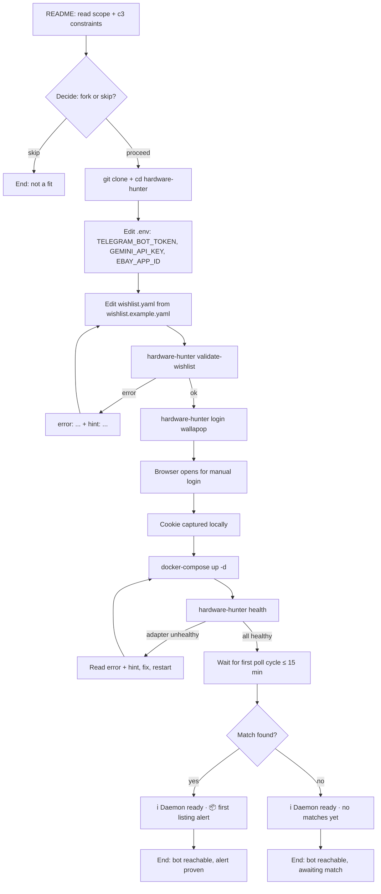
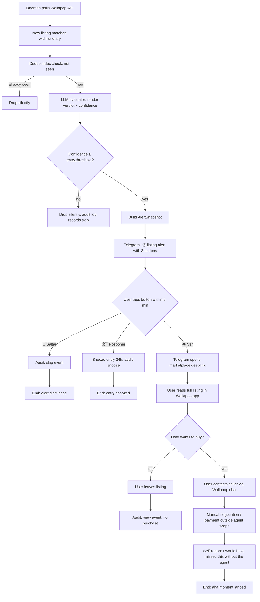
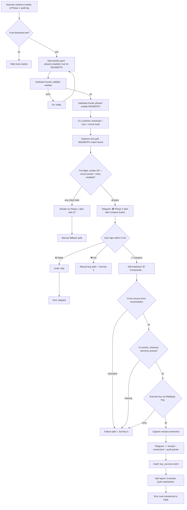
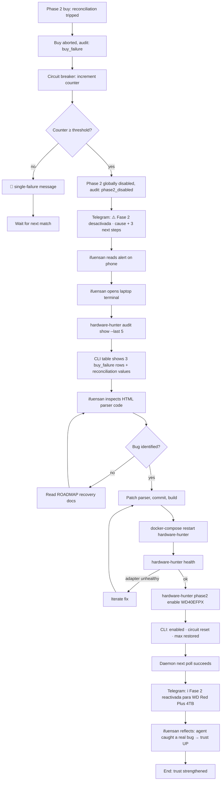
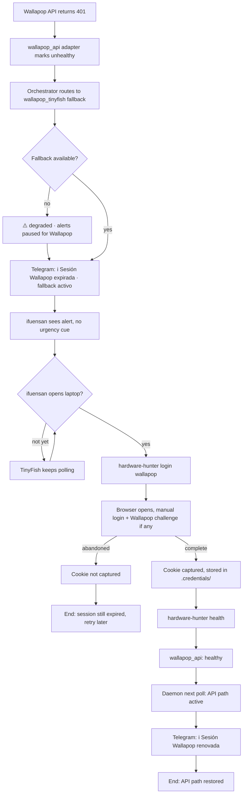
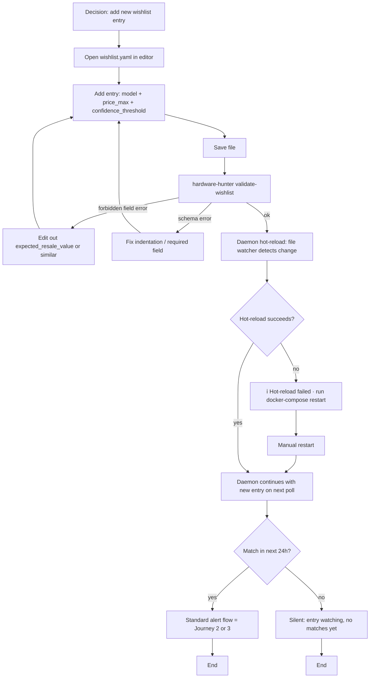

---
stepsCompleted:
  - step-01-init
  - step-02-discovery
  - step-03-core-experience
  - step-04-emotional-response
  - step-05-inspiration
  - step-06-design-system
  - step-07-defining-experience
  - step-08-visual-foundation
  - step-09-design-directions
  - step-10-user-journeys
  - step-11-component-strategy
  - step-12-ux-patterns
  - step-13-responsive-accessibility
  - step-14-complete
lastStep: 14
workflowStatus: complete
completedAt: 2026-05-10
inputDocuments:
  - _bmad-output/planning-artifacts/prd.md
  - _bmad-output/planning-artifacts/architecture.md
  - _bmad-output/planning-artifacts/prfaq-hardware-hunter.md
  - _bmad-output/planning-artifacts/prfaq-hardware-hunter-distillate.md
  - hardware-hunter-bmad-prompt.md
documentCounts:
  prd: 1
  architecture: 1
  prfaq: 2
  kickoff: 1
  brief: 0
  research: 0
  projectDocs: 0
workflowType: ux-design
project_name: hardware-hunter
user_name: ifuensan
date: 2026-05-10
uxScope:
  - telegram-bot-surface
  - operator-cli-surface
  - onboarding-flow
  - failure-recovery-flow
visualUI: false
note: "hardware-hunter has no GUI. UX scope is Telegram message design, inline button choreography, operational alert tone, CLI ergonomics, and failure-recovery UX. No mockups, no wireframes, no design system."
---

# UX Design Specification — hardware-hunter

**Author:** ifuensan
**Date:** 2026-05-10

> **Scope note.** hardware-hunter has no graphical UI. The user surfaces are a Telegram bot (listing alerts, operational alerts) and an operator CLI (`hardware-hunter <subcommand>`). This document specifies UX for those two surfaces — message anatomy, button choreography, operational tone, CLI ergonomics, onboarding, and failure-recovery flows — not screens or wireframes.

<!-- UX design content will be appended sequentially through collaborative workflow steps -->

## Executive Summary

### Project Vision

hardware-hunter is a self-hosted personal agent. It watches Wallapop and eBay.es continuously against a YAML wishlist of specific homelab parts and surfaces matches in Telegram — including parts hidden inside larger listings — with opt-in autonomous purchase via a non-bypassable Telegram tap.

**From a UX perspective, the product is two surfaces:**

1. A **Telegram bot** the user reads and taps on a phone, anywhere, anytime. The product's daily face.
2. An **operator CLI** the same person uses on a laptop during deliberate maintenance sessions. The product's troubleshooting face.

There is no GUI. There is no website. There is no mobile app of our own. Telegram is the user surface; the terminal is the operator surface. UX work here is about making both surfaces feel **considered** — the absence of a GUI is not an excuse for low-quality interaction design.

### Target Users

**Primary user: ifuensan (the homelabber).**

- Spanish, Valencia-based. Runs a Synology RS818+ NAS plus an HPE DL160 Gen10 in a colo.
- Extremely tech-savvy. Speaks Docker, YAML, Linux command line natively.
- Receives Telegram alerts on his phone wherever he is — at his day job, in a meeting, at lunch, evening at home.
- Decision window per alert: ~90 seconds (chat the seller before someone else does), or ~5 seconds in Phase 2 (tap *Comprar* and move on).
- Reads Castilian Spanish naturally; reads English fluently as a software engineer.

**Operator hat (same person, different mode): ifuensan-as-operator.**

- Saturday-morning maintenance window with a terminal open.
- Wants tight CLI ergonomics: subcommands that suggest themselves, error messages that name the next step, JSON output that pipes cleanly into `jq`.
- During emergencies (marketplace adapter break, Wallapop session expiry, smoke-test drift), wants to recover in ≤ 15 minutes without reading docs.

**Side-effect audience: OSS fork users.**

- Other Spanish homelabbers who clone the repo, copy `wishlist.example.yaml`, run `docker-compose up`, point Telegram at their own bot.
- Tech profile identical to the primary user.
- Read the README, expect English documentation as a baseline norm for OSS.
- Per (c3): adoption is a side benefit, not a goal — UX should not be optimized for forker convenience at the primary user's expense.

### Key Design Challenges

1. **Trust gradient for Phase 2.** The user must mentally upgrade from "agent shows me stuff" → "agent buys things". The 4–8 week trust window means Phase 1 alerts must feel reliable enough that the user voluntarily flips Phase 2 on. False positives, weird formatting, ambiguous LLM takes, or missing data all erode trust. Phase 1 alert quality directly determines whether Phase 2 ever ships in production.

2. **Operational alert tone under stress.** When Phase 2 auto-disables (the Q9 silent-failure scenario), the user is mildly stressed and trying to triage on a phone. The alert must answer three questions in one read: *what happened, why, what do I do next.* Anything less forces investigation.

3. **Container-listing alerts on a phone screen.** The headline differentiator (FR14, container detection) means alerts can be for a wrapper listing — e.g., "NAS Synology DS220 con 2 discos" — where the wanted part is inside. The user needs to see BOTH the wrapper context AND the wanted part identification ("LLM thinks the discos are WD Red 4TB based on the photo metadata") in one glance. Information density vs. mobile readability is the tension.

4. **Operator CLI in emergency mode.** Wallapop session expires Saturday morning; the user wants the agent healthy again before his coffee gets cold. Subcommand discoverability (`hardware-hunter --help` reads like a recovery playbook), error messages that include the next CLI invocation to run, and structured JSON output for piping into `jq`-based recovery scripts all matter.

5. **No-GUI quality bar.** The product is a daemon, but UX still distinguishes hardware-hunter from the existing Wallapop bots. Message formatting, button labels, microcopy, and operator output texture are where the considered-design signal lives.

### Design Opportunities

1. **Information density tuned to the 4-hour listing half-life.** Every alert is a ticking clock. Design goal: snap decision in ≤ 5 seconds of scanning a phone screen. Format optimizations matter more here than in any GUI product because the alert *is* the entire interaction surface.

2. **Operational alerts as self-documenting recovery flows.** Calm + instructional tone — every high-priority alert names cause + next CLI command. The user learns the system by reading alerts, not docs. Reduces operator-mode reading burden during stress.

3. **CLI as a calm interface during chaos.** Clear next-step messages; no stack traces unless `--debug`; structured JSON ready to pipe. Stressed-operator UX is an underdesigned space in OSS infra-tools; hardware-hunter can be the exception.

4. **Onboarding that respects the expert.** The user IS the operator IS the developer. No tutorial scaffolding, no guided wizard, no overhelpful CLI prompts. `init` scaffolds, `login` prompts for credentials, `validate-wishlist` confirms. The 60-second-setup story is the goal.

### Language & Tone Decisions (locked)

| Surface | Language | Rationale |
|---|---|---|
| **Telegram user-facing** (listing alerts, button labels, operational alerts the user reads) | **Spanish (Castilian)** | Daily-reading register for ifuensan; matches the (c3) Spanish-homelabber audience; "Comprar / Saltar / Ver" reads naturally |
| **Operator / CLI surface** (CLI output, log lines, error messages, README, CONTRIBUTING, ROADMAP, code comments) | **English** | OSS standard; forker-friendly; aligns with Stack Overflow / GitHub norms; FRs are already English |
| **High-priority operational alerts (Telegram)** | Spanish, **calm + instructional** tone | Names the cause + the next CLI command in one read. "⚠️ Fase 2 desactivada. Cross-source price reconciliation: API 53.00 vs HTML 0.53. Revisa el parser HTML, luego `hardware-hunter phase2 enable <entry>` para reactivar." Self-documenting under stress. |
| **Informational operational alerts (Telegram)** | Spanish, **direct + minimal** tone | Lower-stakes signal; no next-step needed. "ℹ️ Sesión Wallapop expirada. Ejecuta `hardware-hunter login wallapop` cuando puedas." |
| **Listing data inside alerts** | Whatever the marketplace published (typically Spanish on Wallapop, often Spanish or English on eBay.es) | We don't translate listing content — that's the seller's voice |

**Bilingual asymmetry by design.** The user-facing surface (Telegram) lives in Spanish because it's daily reading for one person; the operator surface (CLI, code, docs) lives in English because it lives at the GitHub norm. A single fork-runner who doesn't read Spanish can override Telegram strings via a `config.yaml > telegram.locale` flag (post-launch enhancement, OQ-tracked); at v1 the user-surface strings are Spanish-only.

## Core User Experience

### Defining Experience

The defining experience of hardware-hunter is a **5-second decision on a phone screen**:

> Phone buzzes. ifuensan glances. He sees photo, price, location, one-line LLM take, confidence level. He taps *Comprar* (or *Ver*, or *Saltar*). The agent handles the rest.

Everything else exists to make that one moment trustworthy. Marketplace polling, listing dedup, LLM evaluation, prompt anchoring, container detection, cross-source price reconciliation, fail-closed buy flows, audit logging — all invisible scaffolding around a single Telegram message that has to be readable, scannable, and tappable in five seconds.

The secondary experience is **the operator session**: the user opens a terminal on his laptop, runs `hardware-hunter login wallapop`, edits `wishlist.yaml`, runs `hardware-hunter validate-wishlist`, runs `docker-compose restart`. Twelve minutes from session-expired alert to back-in-production.

### Platform Strategy

**Telegram surface** (the daily face):

- **Telegram clients on iOS, Android, desktop, and web** — all work identically because the bot uses the standard Bot API. We don't ship our own client.
- **Phone is the primary device.** Rare to receive an alert and tap from desktop Telegram; if the user is at a desktop, he probably has the terminal open and would already know the alert is coming.
- **Touch-based interaction.** Inline buttons are the only input; no typed messages from the user (the bot ignores text input from the user — it's a one-way notification + button-tap channel).
- **No offline support needed.** Telegram delivers as soon as the user's device next has connectivity; we don't queue or rate-limit for offline scenarios.

**CLI surface** (the operator face):

- **POSIX terminal.** Linux primary (homelab box), macOS for ifuensan's laptop. Windows via WSL is supported but not validated.
- **Color when stdout is a TTY; plain when piped.** `--no-color` flag forces plain.
- **JSON output via `--format json`** — designed to pipe into `jq` and other shell tools.
- **No interactive prompts in non-TTY contexts** (e.g., docker-compose run). Commands fail fast on missing args rather than blocking on input.

**There is no GUI, no web dashboard, no mobile app, no desktop app.** Resisting these is a feature, not a limitation — they would impose operational overhead disproportionate to single-user value.

### Effortless Interactions

These should require zero thought from the user; if any of them feels like work, the design has failed.

| Interaction | Effortless because |
|---|---|
| **Tapping a Phase 1 alert button** (*Ver* / *Saltar* / *Posponer 24h*) | Inline keyboard renders natively in Telegram; one tap; no confirmation modal; agent state updates invisibly |
| **Tapping a Phase 2 *Comprar* button** | One tap; reconciliation + UI checks happen behind the scenes; user gets a confirmation message with receipt screenshot when the transaction completes |
| **Reading an operational alert at 09:30 Saturday morning** | The alert names the cause AND the next CLI command; user pastes the command, runs it, problem solved without opening docs |
| **Adding a new wishlist entry** | Edit `wishlist.yaml` in a text editor, run `hardware-hunter validate-wishlist`, restart the daemon; no migration, no UI, no recompilation |
| **Inspecting why an alert fired** | `hardware-hunter audit show --last 1` returns the alert snapshot + LLM evaluation + confidence — no log spelunking |
| **Marketplace adapter break recovery** | Operational alert says "Wallapop API responding 401; run `hardware-hunter login wallapop`"; user runs it; cookie refreshed; daemon resumes on next poll |
| **Snoozing an entry that's noisy that day** | One tap on *Posponer 24h*; entry-level snooze takes effect immediately; user moves on |

What happens automatically (without user intervention):

- Listing deduplication (same listing won't fire twice).
- LLM evaluation caching with TTL (no redundant API calls).
- eBay OAuth token refresh.
- Two-path Wallapop fallback (TinyFish picks up if unofficial API fails mid-poll).
- Phase 2 cross-source price reconciliation before every buy.
- Daily Phase 2 smoke test at 06:00.
- Per-purchase circuit breaker that auto-disables Phase 2 globally on N consecutive failures.

What does NOT happen automatically (by design):

- Wallapop session re-login (anti-bot risk; manual `hardware-hunter login wallapop` always).
- Phase 2 re-enable after auto-disable (operator must explicitly `phase2 enable <entry>`).
- Config-file overwrite during `init` (refuses without `--force` + interactive confirm).
- Buying without a Telegram tap (no fully-autonomous mode exists; FR29).

### Critical Success Moments

The moments that determine whether the product feels right or wrong.

**Make-or-break moments:**

1. **First alert that the user would have missed.** The aha! moment from PRD Journey 1. If the format is good and the LLM take is accurate, ifuensan trusts the agent. If the alert is malformed or the LLM take is off, every subsequent alert is read with skepticism. **First alert is everything.**

2. **First Phase 2 buy completion.** Journey 2. The user taps *Comprar*, waits ~22 seconds, gets a confirmation message with receipt screenshot. If anything is off — wrong price, missing screenshot, unclear "did it actually buy?" — Phase 2 trust collapses for months. **The receipt confirmation message is where Phase 2 graduates from a feature to a habit.**

3. **First Phase 2 auto-disable.** Journey 3 (Q9 scenario). When this fires, the user is on his phone, mildly stressed. If the alert tells him *what failed and what to run next* in one read, he handles it in 10 minutes and trusts the system more (the agent caught a bug). If the alert is cryptic, he turns Phase 2 off permanently. **Operational alert quality determines whether reconciliation is a feature or a fear.**

4. **First Wallapop session expiry.** The agent stops alerting on Wallapop. The operational alert tells him to run `hardware-hunter login wallapop`. He runs it on his laptop, completes the browser flow, restarts the daemon. **If the recovery is smooth, the daemon-style operation feels mature; if there's friction, the user starts dreading Saturdays.**

5. **First container-detection alert that's a true positive.** PRD Success Criterion: ≥ 1 user-confirmed container alert in first 90 days. **This is when the headline differentiator stops being a claim and becomes a fact.**

6. **First time a fork user runs the install successfully.** The README + `.env.example` + `wishlist.example.yaml` + `docker-compose up` chain works first try. **If any step in this chain has a hidden gotcha, the project's OSS-side audience evaporates.**

### Experience Principles

These principles trump local optimization. When two design choices conflict, fall back to these.

**1. Five-second-decision optimization.**

Every Telegram listing alert is designed to enable a snap decision in ≤ 5 seconds of phone-screen scanning. Photo first, price second, LLM take third, buttons fourth. If a field doesn't help that decision, it gets cut. Field count is a budget; we spend it on signal, not nicety.

**2. No silent failure.**

Every degradation produces three side effects: a structured log line, an operational Telegram alert, and an entry in `health` state. The user never has to check whether the agent is healthy by inference. Failure is loud, recovery is named, and "is it working?" is always answerable in one alert or one CLI command.

**3. Calm under stress.**

When something fails, the user is mildly stressed and looking at a phone. Operational alerts answer three questions in one read — *what happened, why, what do I do next.* CLI error messages name the next command to run, not just the problem. We design for the worst-case operator state, not the optimistic one.

**4. Manual recovery boundaries are sacred.**

The agent never auto-recovers from: Wallapop session expiry, Phase 2 auto-disable, config-file overwrite. These boundaries protect the user from cascading failures and from anti-bot escalation. Resist any future feature request that pushes one of these into automation.

**5. Operator and user are the same person — design for the maintainer.**

ifuensan is the user, the operator, the developer, and the data controller. There are no "non-technical user" personas to dumb down for. Onboarding has no tutorial scaffolding; CLI prompts no helpful tips; alerts assume technical literacy. The product respects expertise — that's the texture that distinguishes it from consumer-grade Telegram bots.

**6. Bilingual asymmetry is principled.**

Telegram surface in Spanish (Castilian) — daily reading, single user. CLI / docs / code in English — OSS norm, forker-friendly. Resist mixing. If a forker wants Telegram in English, that's a `config.yaml > telegram.locale` flag (post-launch); the v1 default is Spanish on Telegram, English everywhere else.

**7. The wishlist is the user's intent — the LLM never overrides it.**

The LLM verifies a match against an entry; it never picks. No off-wishlist alerts. No "interesting deal" surfacing. No arbitrage scoring. The wishlist YAML is the authoritative declaration of what the user wants. This is a UX principle as much as a scope principle: it's why every alert feels purposeful rather than spammy.

## Desired Emotional Response

### Primary Emotional Goals

The dominant feeling we are designing for is **calm confidence** — the agent runs in the background, alerts are purposeful (not noise), the user trusts that nothing important is being missed and nothing surprising will happen. This is unusual for a product: most software wants users excited, engaged, scrolling. hardware-hunter wants users **mostly absent** — the product succeeds when ifuensan stops thinking about it.

**Primary emotional goal:** Calm — the user no longer wakes up wondering if a deal slipped past, no longer refreshes Wallapop at lunch, no longer feels the time-tax pull. The agent is on watch.

**Secondary emotional goals (in priority order):**

1. **In control.** The user is always the decision-maker; the agent never bypasses a tap. Manual recovery boundaries (no silent re-login, no Phase 2 auto-re-enable) reinforce that control is preserved through every failure mode.
2. **Trust** — earned over weeks, not assumed. Phase 1 alerts that prove reliable build the trust gradient that lets Phase 2 ever ship.
3. **Quiet satisfaction.** When an alert turns into a deal caught (or a Phase 2 purchase completed cleanly), the user feels that quiet "it worked" satisfaction — not "wow look what I built" pride. The product is plumbing, and good plumbing feels invisible until the moment it does its job.
4. **Mature respect** — when something fails, the user learns the system handled it well. The Q9 silent-failure scenario, when caught by reconciliation, increases trust (the agent caught a real bug) rather than decreasing it.

### Emotional Journey Mapping

**Discovery → setup (one-time, ~60 minutes for a fork user, ~15–30 minutes for ifuensan personally):**

| Stage | Desired feeling | What creates it |
|---|---|---|
| Read README | "This sounds like exactly what I need" | Honest framing ("personal monitoring tool"), explicit (c3) scope, customer-FAQ that admits when saved searches are a better fit |
| `git clone` + `docker-compose up` first run | Mild curiosity, no resistance | Single-command install; no surprises; example wishlist that demonstrates the schema |
| First `hardware-hunter login wallapop` | Brief friction, expected | Manual login is anti-bot-correct; user understands the trade-off from README |
| First `validate-wishlist` runs green | Quiet satisfaction | "It accepted my YAML" — small win that signals the system is working |
| Wait for first alert | Patience, mild anticipation | No fake "system loading…" indicators; the user knows it polls every 15 min |

**First alert (the aha! moment):**

| Stage | Desired feeling | What creates it |
|---|---|---|
| Phone buzzes for the first time | Surprise → recognition | Telegram alert format is photo-first; user's eye lands on the part image they've been hunting |
| Read the LLM take | Trust seed | One-line take is specific ("photos show a real WD Red, serial visible") not generic ("this is a hard drive") |
| Tap [👁 Ver] | No friction | Direct deeplink to listing; user sees full page in Wallapop app |
| Buy manually | Quiet satisfaction | "I would have missed this without the agent." The aha! moment lands. |

**Steady-state Phase 1 (weeks):**

| Stage | Desired feeling | What creates it |
|---|---|---|
| Receive 5–10 alerts/week | Calm, in control | Alerts feel purposeful (no "good deals" noise); easy to dismiss with [🙅 Saltar] |
| Receive a low-confidence alert | Mild interest, not anxiety | Confidence level shown explicitly; user knows the LLM is uncertain |
| Receive a container alert | Mild excitement (the differentiator working) | Wrapper context AND wanted part are both visible; user can decide quickly whether to chase it |
| Receive a snoozed entry's alert after 24h | Resumed engagement | Snooze worked; user wasn't bombarded that day; alerts return naturally |

**Phase 2 transition (week 4–8):**

| Stage | Desired feeling | What creates it |
|---|---|---|
| Decide to enable Phase 2 for one entry | Considered, not impulsive | The 4–8 week trust window is real; user decides when, not the product |
| Run `hardware-hunter phase2 enable WD40EFPX` | Felt sense of stepping over a threshold | CLI confirms "Phase 2 enabled for WD Red Plus 4TB / WD40EFPX. Default confidence threshold: high." |
| First Phase 2 alert with [✅ Comprar] button | Brief nervousness, not fear | The agent has 6 weeks of clean Phase 1 history; the trust transfers |
| Tap [✅ Comprar] | Decision-tap, not commitment-anxiety | Reconciliation + UI checks happen invisibly; user already trusts the agent's judgment |
| Receive `✅ Comprado · 60.00€ via Wallapop Pay · Receipt: WAL-7Q4-XYZ · [screenshot]` | Quiet satisfaction → habit formation | Receipt confirmation is factual; screenshot proves the transaction; audit log records it |

**Failure modes (Phase 2 auto-disable):**

| Stage | Desired feeling | What creates it |
|---|---|---|
| Operational alert fires (`⚠️ Fase 2 desactivada…`) | Mild alarm, not panic | Calm + instructional tone; cause + next step in one read |
| Read alert | Recognition ("the system caught a real bug") | Specific data (API 53.00 vs HTML 0.53) makes the cause concrete and verifiable |
| Run `hardware-hunter audit show --last 1` | Confirmed understanding | Audit log shows the exact alert + reconciliation result |
| Patch the parser, run `phase2 enable` | Recovered control | Operator action restores Phase 2; no auto-recovery means no surprise re-enables |
| Reflection 30 min later | **Increased trust** | The agent did its job. The reconciliation stack worked exactly as designed. Phase 2 trust is now stronger, not weaker. |

**Walk-away (worst case, multi-year horizon):**

| Stage | Desired feeling | What creates it |
|---|---|---|
| Realize maintenance burden has crossed walk-away threshold | No betrayal | Walk-away triggers are pre-documented; user knew this could happen |
| Pin dependencies, archive repo, README addendum | Quiet closure | Graceful off-ramp procedure; not silent abandonment |
| Watch a fork pick up the project | Modest pride, no FOMO | MIT license + small codebase made the handoff possible by design |

### Micro-Emotions

| Micro-emotion | Where in the experience | Mechanism |
|---|---|---|
| **Confidence > Confusion** | Every CLI error | Errors name the next command, not just the problem |
| **Trust > Skepticism** | Phase 2 enablement | 4–8 week trust window earned through Phase 1 alert reliability |
| **Calm > Anxiety** | Steady-state operation | Daemon is silent unless something matches; no fake "system active" indicators |
| **Accomplishment > Frustration** | Recovery flows | Operational alerts make recovery explicit and named |
| **Quiet pride > FOMO** | Receiving an alert vs. peer not having an agent | Purposeful alerts (no spam); user knows the alerts they receive are real signal |
| **Mature respect > Brittle distrust** | Phase 2 auto-disable | The agent caught a bug — that's competence, not failure |
| **Control > Helplessness** | Manual recovery boundaries | No silent re-login, no auto Phase 2 re-enable; operator intent is always required |
| **Specificity > Vagueness** | LLM one-line take | "Photos show a real WD Red, serial visible" beats "this is a hard drive" |

### Emotions to Avoid

- **FOMO** (fear of missing alerts) → mitigated by ≤ 20 min p95 alert delivery (NFR-P1) and the seen-listings dedup that prevents the same listing from firing twice
- **Buyer's remorse** → mitigated by per-entry max prices (FR26), confidence thresholds (FR27), and the cross-source price reconciliation (FR31) that catches malformed data before checkout
- **Surprise charges** → mitigated by NFR-C2 (≤ €1/purchase ceiling) and OQ3 (per-purchase cost measurement before Phase 2 docs go public)
- **Overhelpful nagging** → no notification spam; no "are you sure?" modals (except where truly destructive: `init --force`, `phase2 disable --all`); no tutorial scaffolding
- **Cryptic-failure dread** → no silent failures (every degradation produces three side effects); operational alerts name cause + next step
- **Vendor-lock anxiety** → all data local (NFR-PR1–5), MIT license, MIT-licensed Hermes, no SaaS dependency for primary functionality
- **"Did the agent buy it correctly?" doubt** → receipt confirmation message includes price actually paid and screenshot of the marketplace confirmation page (FR36)

### Design Implications

The emotional goals translate to specific UX choices, several of which override common product-design defaults:

| Emotional goal | UX design choice | What we resist |
|---|---|---|
| **Calm dominance** | Silence is acceptable. The bot does NOT send "I'm watching" status updates, "system healthy" pings, or weekly summaries. | Engagement-style notifications, gamification, streak counters |
| **In control** | Every Telegram alert has explicit action buttons; no implicit "tap anywhere to dismiss"; no swipe-to-buy. | Smart defaults that preempt user judgment; reducing friction below the level of intent |
| **Earned trust** | Confidence levels surfaced explicitly on every alert; no hiding LLM uncertainty. | Smoothing over LLM uncertainty to make alerts feel "more trustworthy" |
| **Quiet satisfaction** | Receipt confirmation message is factual ("✅ Comprado. 60.00€ via Wallapop Pay. Receipt: WAL-XYZ. [screenshot]") not celebratory. | Confetti emoji, "Deal secured! 🎉", excessive enthusiasm |
| **Mature respect on failure** | Operational alerts admit what happened in plain Spanish with concrete numbers. | Cushioning language ("oops!", "we hit a snag") that obscures what went wrong |
| **Specificity** | LLM one-line take is required to be specific to the listing. Generic takes ("looks fine") fail review. | LLM safety hedging that produces noncommittal takes |
| **Operator dignity** | CLI assumes technical literacy; no patronizing prompts; output is dense and informative. | "Helpful tips" interleaved with command output, animated progress bars, beginner-friendly verbosity |
| **Control over recovery** | Manual re-auth, manual Phase 2 re-enable, manual config-overwrite confirmation. | "Smart recovery" that auto-fixes things behind the user's back |
| **No anxiety about cost** | Per-purchase cost ceiling (NFR-C2); cost surfaced in `health` command; no surprise billing. | Ambiguous "free tier" messaging; opaque per-purchase pricing |

### Emotional Design Principles

**1. The agent is good plumbing, not a personality.**

No bot personality, no emoji-heavy "friendly" tone, no "Hi! I'm hardware-hunter 🤖". Operational alerts and CLI output are direct, factual, and infrastructural. The product feels mature because it doesn't perform maturity.

**2. Silence is success.**

When the agent has nothing to say, it says nothing. No "still watching!" pings, no "no listings matched today" summaries, no "you're using the bot regularly!" engagement nudges. The absence of noise is a feature.

**3. Specificity is trust.**

Every alert, every CLI message, every audit entry contains specific concrete data — exact prices, exact listing IDs, exact reconciliation values, exact next commands. Vagueness is a trust killer; we prefer terse-and-specific over warm-and-vague.

**4. Failure modes earn respect, not apology.**

When Phase 2 auto-disables, the agent does not apologize. It reports what happened, why, and what to do next. The tone is "the system noticed and acted correctly" — because that is actually what happened.

**5. The receipt is sacred.**

Phase 2 confirmation messages — receipt ID, price paid, screenshot of the marketplace confirmation page — are the highest-stakes UX surface in the entire product. They lock in trust or destroy it. Resist any shortcuts here. If a screenshot is unavailable, fail closed and re-Telegram with the missing-screenshot context, even if the purchase succeeded.

**6. Don't perform helpfulness.**

No "Hey ifuensan, looks like you haven't checked your alerts in a while 👀". No "Tip: did you know you can…". The product is for an expert who already chose to install it. Helpfulness here reads as condescension.

## UX Pattern Analysis & Inspiration

Hardware-hunter has no graphical UI, so traditional "favorite app" inspiration doesn't translate. Instead, three categories of mature interaction surface inform the design: Telegram-bot patterns, CLI-tool ergonomics, and incident/notification systems. The bias throughout: borrow from infrastructure-grade tools, not consumer apps.

### Inspiring Products Analysis

#### Telegram bot patterns

**@BotFather (Telegram's own bot for creating bots).**

- Terse, instructional, zero personality. Each message tells you exactly what to do next.
- Inline keyboard for safe actions (token regeneration, command setting); no inline keyboard for destructive ones (those require typing the bot name as confirmation).
- **Take:** the master class in operator-grade Telegram UX. Format alerts the way @BotFather formats responses: name the next thing.

**Generic price-watch / drop-watch bots (e.g. Idealo PriceWatch on Telegram, custom CamelCamelCamel-style bots).**

- Alert format converges on the same shape: photo + price + previous price + button to view. We borrow the photo-first, price-second pattern.
- Anti-pattern they often fall into: noisy "still alive!" weekly summaries.
- **Take:** Adopt the photo-first format. Skip the engagement nudges.

**PagerDuty / OpsGenie Telegram integrations.**

- Distinguish severity via emoji prefix (`🔴` critical, `🟡` warning, `🔵` info). We use `⚠️` and `ℹ️` for the same reason.
- Each alert message contains: identifier, severity, affected service, suggested runbook link.
- **Take:** Use the severity-prefix pattern. Embed the next CLI command instead of a runbook link (since we own both surfaces).

**Stripe / payment-confirmation messages.**

- Receipt-of-purchase messages are factual, short, and contain: amount, payment method, transaction ID, timestamp, item description.
- No celebratory language ("YOU GOT IT!"). Just the facts.
- **Take:** Phase 2 confirmation messages copy this register exactly.

#### CLI tool patterns

**`gh` (GitHub CLI).**

- Subcommand-first ergonomics: `gh pr create`, `gh issue list`. Hierarchical and discoverable via `gh <noun> --help`.
- `--json <fields>` flag for machine output. Default human-readable with subtle color.
- **Take:** Mirror the structure with `hardware-hunter <noun> <verb>` (`phase2 enable`, `audit show`). Use `--format json` exactly as gh does.

**`git`.**

- Stable exit codes (0 success, 1 generic error, 128 fatal); operators can rely on them in scripts forever.
- Error messages name the next action when one is sensible: `error: failed to push some refs to '...' \nhint: Updates were rejected because the remote contains work that you do \nnot have locally. ...`
- **Take:** Stable exit codes (locked at FR48). Error messages that include hints. Do not copy git's verbosity though — keep it tighter.

**`kubectl`.**

- Verb-noun pattern (`kubectl get pods`, `kubectl describe deployment`). Predictable.
- `kubectl <verb> <resource>` works for any new resource, by convention. Discoverability via `kubectl api-resources`.
- **Take:** Predictability is more valuable than cleverness. `hardware-hunter audit show` and `hardware-hunter phase2 enable` follow the same shape; new operator commands fit the same pattern.

**`restic` / `borg` (backup tools).**

- Calm operational reporting. Long-running ops emit periodic structured progress without spamming.
- Errors are specific: "lock is stale; run `restic unlock` to remove it."
- **Take:** Operational logs report meaningful events, not progress spinners. Errors name remediation.

**`flyctl` (Fly.io).**

- Modern Go-CLI UX: emoji-prefixed status lines, color-coded output that respects `--no-color`, JSON via `--json`.
- Shipping a great single-binary install story.
- **Take:** Emoji prefixes are OK for status lines (we use `⚠️` and `ℹ️` already). Keep them rare and meaningful.

**`ripgrep`.**

- Fast, terse, no over-communication. Does one thing well.
- **Take:** When commands have nothing to report, they say nothing. (e.g., `validate-wishlist` exits 0 silently when the wishlist is fine; speaks only when there's a problem.)

#### Incident / notification system patterns

**Sentry.**

- Error reports include: stack trace, environment, user context, related events, "fix" suggestions when known.
- Issue grouping de-duplicates noise.
- **Take:** Operational alerts and audit-log entries should resemble Sentry events: enough context to root-cause without re-running. The seen-listings dedup is our equivalent of Sentry's issue grouping.

**Prometheus AlertManager.**

- Alerts have labels (severity, service, team) and annotations (summary, description, runbook URL).
- Inhibition rules prevent alert storms.
- **Take:** Borrow the structured-fields approach — every operational Telegram alert has implicit labels (severity prefix) and a summary + description + next-step.

**Stripe Dashboard "audit log."**

- Append-only event log; queryable by time and event type; per-event detail page.
- **Take:** `hardware-hunter audit show` is the equivalent. The Stripe metaphor: each alert/tap/transaction is an immutable event row; investigation means reading rows, not reconstructing state.

**Uptime Kuma.**

- Self-hosted status monitoring. Quiet by default; loud only when something is down.
- **Take:** Same posture for the daemon. Health is reported on demand (`health`), never pushed.

### Transferable UX Patterns

| Pattern | Source | Where we apply it |
|---|---|---|
| **Photo-first listing alert layout** | Price-watch bots | Phase 1 + Phase 2 listing alerts (Telegram) |
| **Severity-prefix on operational alerts** (`⚠️`/`ℹ️`) | PagerDuty, AlertManager | All operational Telegram alerts (FR21) |
| **Receipt as factual confirmation, not celebration** | Stripe | Phase 2 buy confirmation message |
| **Subcommand hierarchy** (noun verb) | `gh`, `kubectl` | `hardware-hunter <area> <action>` (phase2/audit/login) |
| **Error message includes next command** | git, restic | Every CLI error; every operational Telegram alert in calm-instructional tone |
| **Stable exit codes for scripting** | git, all UNIX tools | FR48 locked codes 0/1/2/3/4/5 |
| **`--format json` for machine output** | gh, jq-friendly tools | Every read-only operator command |
| **Color when TTY, plain when piped** | gh, ripgrep | All CLI output |
| **Append-only audit/event log** | Stripe, Sentry, AWS CloudTrail | Phase 2 audit log (FR36) |
| **Issue dedup / event grouping** | Sentry | seen-listings dedup index (FR10) |
| **Health command on demand** | Uptime Kuma, kubectl | `hardware-hunter health` (FR47) |
| **Silence when nothing to report** | ripgrep, restic, cron | All scheduled jobs; daemon log spam discipline |
| **Calm operational reporting under stress** | restic, borg | Q9 silent-failure recovery alerts |

### Anti-Patterns to Avoid

These come from products in adjacent spaces that erode the calm-confidence emotional goal we want.

| Anti-pattern | Where it shows up | Why we avoid it |
|---|---|---|
| **Engagement nudges** ("You haven't checked alerts in 3 days!") | Slack, email-marketing bots, Duolingo | Performs urgency; conflicts with the (c3) "calm dominance" principle |
| **Over-friendly bot persona** ("Hi! 👋 I'm your shopping assistant 🤖") | Many consumer Telegram bots | The agent is plumbing, not a personality (Emotional Design Principle #1) |
| **Confetti / celebration emoji on transactions** ("Deal secured! 🎉") | Some price-tracker bots | Receipt is factual; celebration would conflict with the trust-through-restraint posture |
| **Cushioning language on errors** ("Oops! Something went wrong 😅") | Many B2C apps | Obscures what actually happened; conflicts with Emotional Design Principle #4 (failure earns respect, not apology) |
| **Helpful tips interleaved with command output** ("💡 Tip: try `--verbose` for more info") | Some modern CLIs | Patronizing for an expert audience; conflicts with operator dignity principle |
| **Animated progress indicators that spin without progress info** | Many CLIs | Implies activity without proving it; we'd rather emit a structured log line per real event |
| **"Smart" auto-recovery that hides what was fixed** | Some self-healing infra tools | Conflicts with manual recovery boundaries (FR12, FR35); user must always know what happened |
| **Vague status summaries** ("Everything looks good!") | Status-page widgets | Conflicts with specificity principle; we want concrete "last poll: 14:32:17, alerts today: 7, Phase 2 enabled on 2 entries" |
| **Modal "are you sure?" prompts on every action** | Heavy-handed B2B tools | We require confirmation only on truly destructive ops (`init --force`, `phase2 disable --all`); routine actions are one-tap or one-command |
| **Engagement metrics in the UI** ("You've used the app for 47 days!") | Gamified consumer apps | The agent should disappear once it's working; gamification conflicts with the "user mostly absent" goal |
| **Alert storms when one upstream fails** | Naïve monitoring setups | Mitigated by per-purchase circuit breaker (FR34) and dedup (FR10); a single Wallapop outage does not produce 200 alerts |
| **Notifications that can't be dismissed** | Some banking apps | Every alert has a clear dismissal path (Skip / Snooze) or completes naturally (Ver / Comprar) |
| **"Pro tips" that demand engagement** | Many onboarding flows | The product is for an expert who already chose to install it; no engagement loops |

### Design Inspiration Strategy

**What to adopt directly (proven, low-risk):**

- **Photo-first listing alert layout** — borrow from Idealo/CamelCamelCamel-style bots; one quick visual + price + a few signal fields.
- **Severity-prefix operational alerts** — borrow from PagerDuty/AlertManager.
- **Subcommand `noun verb` CLI ergonomics** — borrow from `gh` and `kubectl`.
- **Stable, scriptable exit codes** — borrow from git; lock per FR48.
- **`--format json` everywhere read-only** — borrow from `gh`.
- **Append-only audit log queryable by CLI** — borrow the Stripe/Sentry pattern.
- **Quiet-by-default daemon, loud only on real events** — borrow from Uptime Kuma + restic + cron.

**What to adapt (proven elsewhere, needs tuning for this context):**

- **PagerDuty's "what happened, what to do next" alert structure** — adapt the format to fit Telegram's text + button constraints; embed the next CLI command directly in the alert text since we own both surfaces.
- **Stripe's receipt format** — adapt to Telegram's photo + caption affordance; receipt screenshot included as the Telegram photo with the factual fields in the caption.
- **`git`'s `hint:` lines after errors** — adapt to Spanish in Telegram operational alerts; keep tight rather than verbose.
- **Sentry's "issue group" deduplication** — adapt as the seen-listings dedup index; same conceptual move (group identical events to avoid noise) applied to listings instead of errors.

**What to avoid explicitly:**

- All consumer-app engagement patterns (streaks, achievements, daily check-ins, push notifications about "you might like…").
- Bot persona-building (no name, no avatar voice, no first-person plural "we found a great deal for you").
- Cushioning failure language; we report failures with respect to the user's intelligence.
- Helpful-tip interjections in CLI output; the operator is an expert.
- Auto-recovery that obscures what was fixed; manual recovery boundaries are sacred.
- Pre-built dashboards or web UIs; out of scope by design.

**What we explicitly do NOT borrow from competitors in our space:**

- Tatuck/wallapop-scraper's arbitrage framing (resale-value scoring, margin estimates, off-wishlist surfacing) — these are scope-violating, not just stylistic.
- ZebraBot's commercial-service model (web dashboard, account management) — out of (c3) scope.
- Wallapop's own native saved-search alerts — these are the minimum-viable alternative; we differentiate, not imitate.

The throughline: hardware-hunter inherits its UX register from **infrastructure-grade tools** (kubectl, git, restic, PagerDuty, Stripe), not from **consumer or B2C-engagement tools**. That alignment with the operator/maintainer mindset is what makes the no-GUI surface feel considered rather than minimal.

## Design System Foundation

### Design System Choice

GUI design systems (Material Design, Ant Design, MUI, Tailwind UI, etc.) are **rejected by definition** — hardware-hunter has no graphical UI. Adopting one would imply a phantom dashboard we have no plans to build and conflict with the (c3) "no web UI/dashboard" scope contract.

The design system for hardware-hunter is **two coordinated micro-systems**, one per surface, sharing a common tone:

1. **Telegram message system** — fixed-template message bodies, severity prefix vocabulary, button label vocabulary, callback_data format, MarkdownV2 conventions.
2. **CLI styling system** — color tokens, layout primitives, error format, help format, JSON schema conventions; built on **`rich`** (Astral-adjacent ecosystem; pairs natively with typer).

Both are bespoke (built in-repo), thin (no external design dependencies beyond `rich`), and locked (FR22 freezes the Telegram message format for v1).

### Rationale for Selection

- **No GUI exists** — every GUI design system option is moot.
- **`rich` for CLI** — typer ships native rich integration; it's the de-facto modern Python CLI rendering library; it gives us styled tables (`audit show`/`health`/`phase2 status`), syntax-highlighted JSON, and Panel components for emphasized blocks at the cost of one runtime dep already counted in NFR-M5's 30-dep budget.
- **Custom Telegram conventions** — there is no "Telegram design system" library to adopt. Bots build their own. We codify ours in `src/hardware_hunter/domain/alert.py` as a single rendering module so the format cannot drift across stories.
- **Locked formats serve trust** — the FR22 freeze on Telegram alert format is a UX feature: ifuensan's eye learns where to look for price, where to look for the LLM take, where the buttons appear. Format drift would force re-learning.

### Implementation Approach

**Telegram message system** — implementation lives in `src/hardware_hunter/domain/alert.py` (already locked in architecture).

**Rendering primitives:**

- `RenderedAlert` (pydantic) — the data shape every Telegram alert produces:
  - `text: str` (MarkdownV2-formatted, Spanish)
  - `parse_mode: Literal["MarkdownV2"]`
  - `photo_url: str | None`
  - `inline_keyboard: list[list[InlineButton]] | None`
- `InlineButton` (pydantic) — `text: str` (label, Spanish), `callback_data: str` (format `<surface>:<verb>:<id>`).
- A single-purpose function per template:
  - `render_phase1_listing_alert(snapshot: AlertSnapshot) -> RenderedAlert`
  - `render_phase2_listing_alert(snapshot: AlertSnapshot) -> RenderedAlert`
  - `render_phase2_buy_success(transaction: Transaction) -> RenderedAlert`
  - `render_phase2_buy_failure(reason: BuyFailureReason, ctx: dict) -> RenderedAlert`
  - `render_operational_alert(severity: Severity, event: EventName, ctx: dict) -> RenderedAlert`

**Severity prefix tokens (Spanish surface):**

| Token | Semantics | Used for |
|---|---|---|
| `⚠️ ` | High-priority operational | Phase 2 auto-disable; smoke-test drift; reconciliation tripped; circuit breaker opened |
| `ℹ️ ` | Informational operational | Wallapop session expired; eBay token refresh failed; daemon startup/shutdown |
| `📦` | Phase 1 listing alert | Phase 1-only entries (no Phase 2 button) |
| `🟢` | Phase 2 listing alert | Entries with Phase 2 enabled (Buy button present) |
| `✅` | Phase 2 buy success | Receipt confirmation message |
| `🚫` | Phase 2 buy failure | Buy aborted (UI check, reconciliation, circuit, missing element) |

These six emoji are the **entire design palette** for severity in Telegram. Anything else is forbidden — no `🎉`, no `🚀`, no `❤️`, no decoration.

**Button label vocabulary (Spanish, locked):**

| Label | Where used | callback_data verb |
|---|---|---|
| `👁 Ver` | Phase 1 + Phase 2 alerts (all) | `view` |
| `🙅 Saltar` | Phase 1 + Phase 2 alerts (all) | `skip` |
| `😴 Posponer 24h` | Phase 1 alerts only | `snooze` |
| `✅ Comprar` | Phase 2 alerts only | `buy` |
| `❌ Saltar` | Phase 2 alerts only (alternate of `🙅 Saltar` when paired with Buy for visual symmetry) | `skip` |

The vocabulary is fixed for v1. A `config.yaml > telegram.locale` flag (post-launch) is the only path to override; English equivalents would be `View / Skip / Snooze / Buy`.

**callback_data format (locked):**

```text
<surface>:<verb>:<id>

Examples:
  listing:view:abc123       — view a listing alert
  listing:skip:abc123       — skip a listing alert
  listing:snooze:abc123     — snooze the wishlist entry behind this listing
  listing:buy:abc123        — Phase 2 buy
```

`<surface>` ∈ `{listing, operational}`. `<verb>` is one of the verbs in the table above. `<id>` is the alert UUID. Three colon-delimited segments, never longer; total length ≤ 64 bytes (Telegram's `callback_data` limit).

**MarkdownV2 conventions:**

- `**bold**` for the part identifier and price (the two scan targets).
- `_italics_` for the LLM one-line take.
- Inline `` `code` `` only for technical identifiers (receipt IDs, listing URLs in operational alerts).
- Hyperlinks use `[label](url)` with escaped parens.
- All user-supplied content (listing title, description, seller name) is escaped via a single `escape_markdown_v2()` helper to avoid injection.

**Photo handling:**

- Listing alerts use Telegram's `sendPhoto` with the listing's first image URL (Telegram fetches it from Wallapop/eBay's CDN; we don't proxy or cache photos).
- Phase 2 buy-success messages use `sendPhoto` with the receipt confirmation screenshot URL (rendered from the captured screenshot, hosted briefly via Telegram itself by re-uploading).
- Operational alerts have no photo.

**Inline keyboard layout:**

- 1 row, 3 buttons maximum, in the order: action / dismiss / inspect.
- Phase 1 row: `[👁 Ver] [🙅 Saltar] [😴 Posponer 24h]`.
- Phase 2 row: `[✅ Comprar] [❌ Saltar] [👁 Ver]`.
- Operational alerts: no inline keyboard.

---

**CLI styling system** — implementation lives in `src/hardware_hunter/observability/styling.py` (a small module wrapping `rich`).

**Color tokens (semantic, terminal-respecting):**

| Token | rich style | Used for |
|---|---|---|
| `error` | `bold red` | Error messages, exit code ≠ 0 |
| `warn` | `bold yellow` | Warnings, degraded states |
| `success` | `bold green` | Successful operations, healthy adapters |
| `info` | `bold blue` | Informational status (rare; usually default text) |
| `emphasis` | `bold` (no color) | Headings, command names in help text |
| `secondary` | `dim` (no color) | Hint lines after errors, less-important fields in tables |
| `code` | `cyan` | Inline technical identifiers (paths, command names) |

Colors render only when stdout is a TTY (rich detects this automatically); piped output is plain text.

**Layout primitives (`rich` components):**

- `rich.table.Table` for `audit show`, `health`, `phase2 status`. Border style: `MINIMAL` (subtle, terminal-friendly, no heavy ASCII art).
- `rich.panel.Panel` for `init`'s post-success summary and for grouped help sections. Border style: `ROUNDED`.
- `rich.console.Console` configured with theme, ANSI detection, and `--no-color` override.
- `rich.progress.Progress` is **forbidden** at v1 — conflicts with the "silence is success" principle. No spinners, no fake progress.
- `rich.status.Status` is **forbidden** — same reason. Long-running ops emit log lines, not animated indicators.

**Error message format (locked):**

```text
error: <one-line description, ≤80 chars>
hint: <suggested next command or remediation, ≤120 chars>
```

Two lines. The `error:` prefix is `bold red`; the `hint:` prefix is `dim`. Stack traces only appear when `--debug` is passed; otherwise they go to the structured log.

**Example:**

```text
error: Wallapop session expired (cookie returned 401)
hint: Run `hardware-hunter login wallapop` to re-authenticate
```

**Help text format (typer + rich integration):**

- typer renders help via rich. We use the default rich theme with a custom override for the title color (`bold cyan`) and option flags (`bold`).
- Top-level `--help` shows: usage line, one-paragraph description, command groups (Setup / Wishlist / Phase 2 / Audit / Lifecycle), example invocations.
- Subcommand `--help` shows: usage line, full description (≤ 5 lines), positional args, options table, example invocation.
- Examples are mandatory on every subcommand's help text. No "see docs" placeholder; the help IS the doc.

**JSON output schema conventions (FR48):**

- snake_case field names everywhere.
- ISO 8601 timestamps with millisecond precision and `Z` suffix.
- Booleans as `true`/`false`. `null` for absent values; never empty strings.
- No envelope: `audit show --format json` emits a JSON array of audit objects directly on stdout. No `{"data": [...], "meta": {...}}`.
- Errors go to **stderr** as one-line JSON: `{"error": "<class>", "message": "...", "exit_code": <n>}`.
- Numbers as numbers (prices in € as decimals to two places: `48.00`, not `"48.00 €"` strings).

**Terminal output examples:**

```text
$ hardware-hunter health
hardware-hunter v0.4.2
Daemon: running (PID 1, uptime 3d 14h 22m)

  Adapter         Status    Last Activity
  ─────────────── ───────── ──────────────────────
  wallapop_api    healthy   2026-05-10 14:32:17 Z
  wallapop_tinyfish standby  2026-05-09 22:14:03 Z
  ebay_api        healthy   2026-05-10 14:30:00 Z
  telegram_bot    healthy   2026-05-10 13:48:11 Z
  llm_gemini      healthy   2026-05-10 14:31:55 Z

Phase 2: enabled on 2 entries (WD40EFPX, WUH721414ALE6L4)
         globally disabled? no
         consecutive failures: 0/3 (circuit breaker closed)
         last smoke test: 2026-05-10 06:00:01 Z (pass)
```

```text
$ hardware-hunter validate-wishlist
✓ wishlist.yaml is valid (18 entries; 2 with Phase 2 enabled)
```

```text
$ hardware-hunter validate-wishlist
error: wishlist.yaml validation failed: entry 'WD Red 4TB' contains forbidden field 'expected_resale_value'
hint: Remove the field. hardware-hunter does not support arbitrage scoring; see ROADMAP.md for the future-research repo path.
```

```text
$ hardware-hunter audit show --last 1 --format json
[{"id": 142, "type": "alert_snapshot", "ts": "2026-05-10T14:32:17.842Z", "entry": "Western Digital|WD Red Plus 4TB|WD40EFPX", "marketplace": "wallapop", "listing_id": "abc123", "price_eur": 48.00, "confidence": "high", "phase2_enabled_for_entry": true}]
```

### Customization Strategy

**What is fixed (locked, requires PRD/architecture amendment to change):**

- Telegram alert message format (FR22) — cannot drift across stories; format changes require coordinated audit-log schema migration.
- Severity prefix vocabulary (the six emoji listed above) — anything else is forbidden in code review.
- Button label vocabulary in Spanish — the v1 lexicon is locked; localization is post-launch.
- callback_data format `<surface>:<verb>:<id>` — three segments, max 64 bytes.
- Exit code mapping (FR48) — stable forever in semver.
- JSON schema field names — semver-bound (NFR-M4).

**What is configurable (operator-tunable via `config.yaml`):**

- Color rendering: `--no-color` flag, `NO_COLOR` env var, or non-TTY context disables.
- LLM provider choice: `config.yaml > llm.provider` (Gemini / GPT-4o / Claude Haiku) — does not affect the design system, only the underlying adapter.
- Poll cadences: `config.yaml > schedule.*` — affects timing, not visual design.

**What is post-launch evolvable:**

- `config.yaml > telegram.locale` for fork users wanting English Telegram strings (defaults to `es-ES`; only `es-ES` shipped at v1).
- Additional alert severity tokens if new failure classes appear; would land alongside new event types in `EventName` enum.
- New CLI subcommands following the locked `noun verb` pattern.
- Theme overrides for `rich` (terminal-color customization) — out of scope at v1; users style their terminals, not the app.

### Design Tokens (consolidated reference)

For implementation:

```python
# src/hardware_hunter/observability/styling.py (CLI side)
THEME = {
    "error": "bold red",
    "warn": "bold yellow",
    "success": "bold green",
    "info": "bold blue",
    "emphasis": "bold",
    "secondary": "dim",
    "code": "cyan",
}

# src/hardware_hunter/domain/alert.py (Telegram side)
SEVERITY_TOKENS = {
    "operational_warn": "⚠️ ",
    "operational_info": "ℹ️ ",
    "phase1_listing": "📦",
    "phase2_listing": "🟢",
    "phase2_buy_success": "✅",
    "phase2_buy_failure": "🚫",
}

BUTTON_LABELS = {
    "view": "👁 Ver",
    "skip_phase1": "🙅 Saltar",
    "snooze": "😴 Posponer 24h",
    "buy": "✅ Comprar",
    "skip_phase2": "❌ Saltar",
}

CALLBACK_DATA_FORMAT = "<surface>:<verb>:<id>"  # max 64 bytes
```

These tokens are the **entire design system**. No additional palettes, no spacing scales, no typography ramps. The smallness is the point: a no-GUI product with a tight, fixed token set is harder to drift than a GUI product with a sprawling theme.

## Core User Experience (Mechanics)

### Defining Experience

If hardware-hunter nails one interaction perfectly, everything else follows: **the 5-second Telegram alert decision**.

> Phone buzzes. ifuensan glances at the lock screen. Within 5 seconds — without unlocking, scrolling, or thinking — he knows: *what part is this, how much, where, and what does the LLM think.* He taps one of three buttons. The agent absorbs the consequence.

This is the interaction users describe to friends. It is the moment that justifies the existence of every other component (poller, dedup index, LLM evaluator, container detector, audit log, reconciliation, circuit breaker). All of those exist to make that single Telegram message trustworthy enough to act on in 5 seconds.

The **defining experience for Phase 2** is the same shape, with one extra beat: the user taps `✅ Comprar` and ~22 seconds later receives a factual receipt with a screenshot. The 5-second decision becomes a 5-second commitment, and the agent closes the loop. The receipt is the second-most-important UX surface in the product (after the alert itself); it is where Phase 2 graduates from feature to habit.

### User Mental Model

The user already has strong existing mental models for each surface. We adapt to them rather than invent.

**Mental model — Phase 1 listing alert (the daily case):**

| What the user expects | Why | Implication for design |
|---|---|---|
| "Telegram message about a thing I want" | Same shape as Idealo / CamelCamel / Alertify bots — a known pattern | Photo first, price prominent, brief context. Don't deviate from the dominant price-watch alert layout. |
| "I should be able to act in seconds" | Listings have a 4-hour half-life; user is on a phone | Inline buttons, no typing, no menus, no confirmation modals on the standard actions |
| "If I ignore it, nothing bad happens" | Skip-or-act, no penalty for skipping | No nags, no escalation, no "you have 3 unacted alerts!" guilt |
| "If I tap Snooze the entry stops bothering me for a bit" | Mute/snooze pattern from every messaging app | Snooze is per-wishlist-entry, 24h, immediate; no settings dive needed |
| "The agent might be wrong" | Healthy skepticism toward LLM verdicts | Confidence level shown explicitly; user makes the final call |

**Mental model — Phase 2 listing alert (after the trust window):**

| What the user expects | Why | Implication for design |
|---|---|---|
| "This one I can buy with one tap" | The user explicitly opted into Phase 2 for this entry | The Buy button is THE primary action; visual weight goes to it |
| "If I tap Buy, the agent is committed to closing the deal" | Stripe / Apple Pay-style intent → completion | No second-confirm modal. The tap IS the commitment. Reconciliation runs invisibly. |
| "If something is fishy, the agent should refuse, not me" | The user is delegating the safety check | Cross-source price reconciliation, UI checks, missing-element checks all happen behind the tap; failures produce a `🚫` message, not a "are you sure?" |
| "If it succeeds, I want a receipt" | Stripe / Wallapop Pay / Bizum pattern | Factual receipt message with price paid + screenshot + receipt ID. No celebration. |
| "If it fails, I want to know why and what to do" | OpsGenie / PagerDuty pattern | Failure message names the cause + the next CLI command if any |

**Mental model — Operational alert variants:**

| Variant | What the user expects | Implication for design |
|---|---|---|
| `⚠️` High-priority (Phase 2 disabled, smoke fail, circuit open) | "Something I should look at NOW" | Spanish, calm-instructional, name cause + next CLI; no false-positive `⚠️` for low-stakes events |
| `ℹ️` Informational (session expired, token refresh failed, daemon restart) | "Something I should know but not panic about" | Spanish, direct + minimal, often just one fact + one command |

What the user does NOT have a mental model for (and we deliberately don't introduce):

- **No threaded conversations.** Every alert stands alone; we don't try to "continue the conversation" or "show history" inline.
- **No bot commands typed by the user.** The bot ignores user-typed text. Buttons only.
- **No notifications about agent activity** (polls, evaluations, dedup hits). The mental model is "silence = working".

### Success Criteria

The core experience is "successful" when these criteria hold simultaneously, measured over the first 30–90 days post-launch:

| Criterion | Threshold | How measured |
|---|---|---|
| **5-second scannability** | User correctly identifies part + price + LLM take in ≤ 5s on a phone screen, ≥ 80% of alerts | Self-report; `audit show` includes user-confirmed time-to-decision in retrospective journal |
| **Snap-decision conversion** | User taps a button (any button) on ≥ 60% of Phase 1 alerts within 5 minutes of delivery | Audit log records timestamp delta between alert send and callback received |
| **Phase 2 trust transfer** | User opts into Phase 2 for ≥ 1 entry within 8 weeks of Phase 1 going live | Existence of `phase2.enabled` flag in wishlist.yaml |
| **Phase 2 receipt clarity** | User answers "did the agent buy correctly?" with "yes" without checking marketplace, ≥ 95% of receipts | Self-report; success implies receipt + screenshot are sufficient |
| **Operational recovery time** | After a high-priority operational alert, user runs the named CLI command within 15 minutes, ≥ 80% of incidents | Audit log: operational alert timestamp vs. next CLI invocation |
| **Container detection true positive** | At least 1 user-confirmed wrapper-listing alert in the first 90 days | Manual user confirmation in audit retrospective |
| **No false-`⚠️` complaints** | User does not say "this didn't need to be ⚠️" | Self-report; calibration of severity vocabulary |
| **Silence-as-success** | User does NOT report "is the bot still working?" anxiety | Absence of CLI `health` invocations triggered by FOMO; fewer than 1/month |

What "this just works" feels like at steady state:

- Phone buzzes 5–10 times a week, never on the weekend at 03:00.
- Every buzz is a real candidate; user reads, taps, moves on.
- Phase 2 buys complete with screenshot proof; user feels mild quiet satisfaction, not anxiety.
- Operational alerts are rare; when they fire, recovery is one-command.
- The CLI `health` view confirms what the user already assumed.

### Novel UX Patterns

The defining experience is mostly **established patterns recombined for a specific operator/maintainer audience**. Two genuinely novel elements remain.

**Established patterns (used as-is):**

| Pattern | Origin | Where applied |
|---|---|---|
| Photo-first price-watch alert | Idealo, CamelCamel, every drop bot | Phase 1 + Phase 2 listing alerts |
| Inline button keyboard for triage | Telegram BotFather, every action-oriented bot | All listing alerts |
| Severity-prefix on alerts (`⚠️`/`ℹ️`) | PagerDuty, OpsGenie, AlertManager | All operational alerts |
| Stripe-style factual receipt | Stripe payment receipts | Phase 2 buy success |
| `noun verb` CLI ergonomics | gh, kubectl | All CLI subcommands |
| Append-only event log queryable by CLI | Stripe Events, Sentry, CloudTrail | `audit show` |
| Quiet-by-default daemon | Uptime Kuma, restic | The whole agent |

**Genuinely novel (or at least uncommon enough to warrant deliberate design):**

1. **Container-listing alert** — alerts where the wanted part is **inside** a wrapper listing. There is no established pattern for this in the price-watch space; competing bots either don't detect it or surface it as a normal alert without distinguishing wrapper context. We need to explicitly show two layers (wrapper + extracted part) without confusing the user about what they'd actually be buying. Mitigation: a dedicated visual region in the alert text that names the wrapper ("📦 Listing: NAS Synology DS220 con 2 discos") and the extracted candidate ("Part identified: 2× WD Red 4TB / WD40EFAX, confidence: medium"). User education comes from the first true positive — it teaches itself.

2. **Cross-source price reconciliation visible at the moment of operator triage** — Phase 2 auto-disable alerts surface concrete reconciliation values ("API 53.00 vs HTML 0.53") rather than abstract failure reasons. This is **not** how most monitoring systems format alerts (which lean on metric names + thresholds). Adopting the explicit-numbers-in-the-alert pattern is unusual but high-information; it borrows from Sentry's "specific event context" register more than from PagerDuty's "metric-and-threshold" register. The implication: alert text is dense — three lines of specific numbers + one CLI command. Trust comes from specificity.

Everything else inherits from the established side. The product's novelty is in **what** it watches and **how** it makes Phase 2 safe — not in inventing new interaction primitives.

### Experience Mechanics

Seven mechanics in detail. Each is a single-screen Telegram interaction or a single CLI invocation; together they cover the user's full surface.

#### Mechanic 1 — Phase 1 listing alert (the daily case)

**Initiation.** The orchestrator detects a new listing matching a wishlist entry, runs the LLM evaluator, builds an `AlertSnapshot`, and dispatches via the Telegram adapter. End-to-end p95 ≤ 20 minutes from listing publication on Wallapop/eBay (NFR-P1).

**Anatomy** (rendered via `render_phase1_listing_alert`):

```
[Photo: listing's first image, served by Telegram from the marketplace CDN]

📦 *WD Red Plus 4TB* — *48,00 €*

📍 Valencia · Wallapop
_Photos clear, drive looks unused, seller has 12 prior sales._
🔍 Confidence: high

[👁 Ver]  [🙅 Saltar]  [😴 Posponer 24h]
```

**Anatomy fields, by row:**

- **Photo:** the listing's first image. Cropped to Telegram's default 16:9 preview; the user expands by tapping if they want full resolution.
- **Severity prefix + part identifier:** `📦` token + bold canonical part name (from wishlist entry's `model` or `display_name`). The bold + emoji combo is the strongest scan target; the eye lands here first.
- **Price:** bold, Spanish format (comma decimal, space + €). Second-strongest scan target.
- **Location + marketplace:** `📍 <city> · <marketplace>`. The 📍 is a third-tier emphasis that maintains scannability without competing with the price.
- **LLM one-line take:** italics, English (per Q9b — LLM emits English internally; Telegram surface uses Spanish chrome but the LLM verbatim is allowed in English to avoid translation latency on p95). The take is required to be specific to the listing — generic takes ("looks like a hard drive") fail review.
- **Confidence:** `🔍 Confidence: <low|medium|high>`. Surfaced explicitly; never hidden.
- **Buttons:** three inline keys. `[👁 Ver]` opens the marketplace listing in-app; `[🙅 Saltar]` records a `skip` event in the audit log and dismisses the alert; `[😴 Posponer 24h]` snoozes the wishlist entry for 24 hours, propagated to the orchestrator's filter.

**Interaction.** User taps one button. Latency from tap to acknowledgment: ≤ 1 s on healthy network (Telegram edits the keyboard to show "✓ visto" / "✓ saltado" / "✓ pospuesto 24h" — single Spanish past participle confirming the action).

**Feedback.** The keyboard edit is the feedback. No follow-up message. The audit log records the callback event. If `Ver` was tapped, Telegram's deeplink opens Wallapop/eBay (no further follow-up from us).

**Completion.** Alert is "done" when any button is tapped, OR when 24 hours pass with no action (the alert persists as a Telegram message but is functionally dead — buttons remain tappable but the listing is likely sold by then). No expiry mechanic; we trust the listing's natural decay.

#### Mechanic 2 — Phase 2 listing alert (post-trust-window)

**Initiation.** Same orchestrator path as Mechanic 1, plus a pre-flight check: the wishlist entry has `phase2.enabled: true`, the global Phase 2 kill-switch is closed, the per-purchase circuit breaker is closed, and the daily smoke test passed within the last 24h. If any check fails, the alert renders as a Phase 1 alert (Mechanic 1) with a `📦` prefix instead of `🟢`.

**Anatomy** (rendered via `render_phase2_listing_alert`):

```
[Photo: listing's first image]

🟢 *WD Red Plus 4TB* — *48,00 €*

📍 Madrid · Wallapop
_Single-photo listing but seller history clean, price within wishlist max (60 €)._
🔍 Confidence: high · Phase 2 max: 60,00 €

[✅ Comprar]  [❌ Saltar]  [👁 Ver]
```

**Differences from Mechanic 1:**

- Severity prefix `🟢` instead of `📦` (signals "this one is buyable").
- Confidence row also shows the per-entry `Phase 2 max` ceiling — surfaces the safety net.
- Button row: `[✅ Comprar]` is leftmost (primary action), then `[❌ Saltar]`, then `[👁 Ver]`. The `Comprar` and `Saltar` use different verb pairings to visually distinguish from Phase 1 (`✅` vs `🙅`) — a deliberate small cue that this alert is a different mode.
- No `Posponer` button. Phase 2 entries are deliberately enabled; snoozing them is `phase2 disable <entry>` from the CLI, not a one-tap operation.

**Interaction.** Tapping `✅ Comprar` is the entire commitment. Telegram immediately edits the keyboard to a single non-tappable "🟡 Comprando…" status. Behind the scenes:

1. Cross-source price reconciliation runs (re-fetches API + scrapes HTML; aborts if discrepancy > tolerance).
2. UI checks run (TinyFish/Playwright loads checkout, asserts expected elements).
3. Buy is executed.
4. Receipt screenshot is captured.

p95 end-to-end ≤ 30s (NFR-P3). If anything fails, transition to Mechanic 4 (failure message). If success, transition to Mechanic 3 (receipt).

**Feedback.** The "🟡 Comprando…" status. We resist the temptation to send progress steps ("verifying price… loading checkout…") — silence-while-acting is the calm-confidence register.

**Completion.** Replaced by Mechanic 3 or Mechanic 4.

#### Mechanic 3 — Phase 2 buy success / receipt

**Initiation.** The buy adapter returns `BuyResult.SUCCESS` with a captured screenshot and a marketplace receipt ID.

**Anatomy** (rendered via `render_phase2_buy_success`):

```
[Photo: receipt screenshot — the marketplace's confirmation page, captured at the moment of success]

✅ *Comprado* · 48,00 € · Wallapop Pay

Receipt: `WAL-7Q4-XYZ`
Listing: WD Red Plus 4TB
Tiempo total: 22 s

`hardware-hunter audit show --id 142` for full event trail.
```

**Anatomy fields:**

- **Photo (receipt screenshot):** the highest-stakes UX element in the product. It is the proof. Captured at `confirmation_page_loaded` timestamp; uploaded to Telegram so the message is self-contained (Telegram hosts the photo for the lifetime of the chat).
- **Severity prefix + verb + price + payment method:** `✅` + bold "Comprado" + price + payment method. One line, factual.
- **Receipt ID:** monospace (the user might copy-paste it into Wallapop's order page).
- **Listing identifier:** the canonical part name from the wishlist (not the marketplace's title — the user's mental model is the wishlist).
- **Total time:** end-to-end seconds from `Comprar` tap to confirmation. A small honesty signal; the user can sanity-check that the agent didn't hang.
- **Audit pointer:** the exact CLI command to retrieve the full event trail. Copy-paste-ready.

**Interaction.** None. The receipt is informational. No buttons.

**Feedback.** The presence of the receipt + screenshot IS the feedback. We resist celebratory language; the message is short, factual, and verifiable.

**Completion.** Implicit. The audit log records a `buy_success` event with all metadata.

#### Mechanic 4 — Phase 2 buy failure

**Initiation.** The buy adapter returns `BuyResult.FAILURE` with a `BuyFailureReason` enum value (`reconciliation_tripped`, `ui_check_failed`, `circuit_open`, `missing_element`, `marketplace_error`, `timeout`). The orchestrator may also auto-disable Phase 2 globally per FR34 (consecutive-failures circuit).

**Anatomy** (rendered via `render_phase2_buy_failure`, example for `reconciliation_tripped`):

```
🚫 *Compra abortada* · WD Red Plus 4TB

Causa: cross-source price reconciliation
- Wallapop API: 53,00 €
- Wallapop HTML: 0,53 €
- Tolerancia: 5%

La compra NO se ha ejecutado. La Fase 2 sigue activa para esta entrada.
Si el HTML está roto, ejecuta:
`hardware-hunter audit show --last 1`
y revisa el parser antes de reactivar.
```

**Anatomy fields:**

- **Severity prefix + verb + part identifier:** `🚫` + bold "Compra abortada" + part name. Indicates the *attempt* but no transaction.
- **Cause line:** plain Spanish name of the failure class.
- **Specific values:** for `reconciliation_tripped` the two prices + tolerance; for `ui_check_failed` the missing element name + page URL; for `circuit_open` the consecutive-failure count + the threshold; for `timeout` the elapsed seconds + the limit.
- **Reassurance line:** explicit "La compra NO se ha ejecutado." This kills the "did it actually buy?" anxiety in the worst case, which is the single most important sentence in the whole failure message.
- **State of Phase 2:** explicit one-line statement of whether Phase 2 is still active for this entry, globally disabled, or partially disabled. Removes the cognitive load of figuring out the next state.
- **Next step (if any):** the exact CLI command to investigate / recover. Copy-paste-ready.

For the auto-disable variant (`🚫` + Phase 2 globally suspended), the message also names the trigger (3 consecutive failures, smoke-test drift, etc.) and the unlock command (`hardware-hunter phase2 enable <entry>`).

**Interaction.** None. No buttons. The follow-up happens in the operator's terminal.

**Feedback.** The message itself. The audit log records a `buy_failure` event.

**Completion.** Implicit. If the failure auto-disabled Phase 2, the orchestrator emits a separate operational alert (Mechanic 5) so the user gets the disable signal even if they ignored the failure message.

#### Mechanic 5 — Operational alert (auto-disable / high-priority)

**Initiation.** Reconciliation tripped, smoke test drifted, circuit breaker opened, Wallapop adapter degraded > N consecutive polls, etc. The orchestrator builds an `OperationalEvent`; the Telegram adapter renders via `render_operational_alert(severity="warn", ...)`.

**Anatomy:**

```
⚠️ *Fase 2 desactivada globalmente*

Causa: 3 fallos consecutivos de reconciliation_tripped
Última entrada afectada: WD Red Plus 4TB / WD40EFPX
Estado actual: Fase 2 deshabilitada para 2 entradas

Próximo paso:
1. `hardware-hunter audit show --last 5` para revisar los fallos
2. Patch del parser HTML (probablemente)
3. `hardware-hunter phase2 enable WD40EFPX` para reactivar por entrada
```

**Anatomy fields:**

- **Severity prefix + headline:** `⚠️` + bold one-line headline. The headline is what shows on the lock screen.
- **Causa line:** single sentence naming the cause class + count or threshold context.
- **Last affected entry:** the specific wishlist entry name (lets the user immediately know if it's their critical hunt or a side entry).
- **Estado actual:** current state of Phase 2 — a single line that answers "what does this mean for my agent right now?".
- **Próximo paso (numbered list):** ordered CLI commands. Copy-paste-ready. Never more than 4 steps; if recovery requires more, the third step says "see ROADMAP.md / `hardware-hunter docs recovery`" instead of cluttering the alert.

**Interaction.** None. The recovery is a CLI session.

**Feedback.** The presence of the alert IS the feedback. The audit log records the operational event with full context (so `audit show --last 1` in the CLI matches the alert verbatim).

**Completion.** Implicit. When the user runs `phase2 enable <entry>` and the next poll succeeds, the orchestrator emits an `ℹ️ Fase 2 reactivada para <entry>` alert (Mechanic 6) to close the loop visibly.

#### Mechanic 6 — Operational alert (informational)

**Initiation.** Lower-stakes operational events: Wallapop session expiry, eBay token refresh failure, daemon startup/shutdown, smoke test pass after a previous fail, Phase 2 re-enabled by operator action.

**Anatomy:**

```
ℹ️ Sesión Wallapop expirada

Adapter: wallapop_api (devuelve 401)
Fallback: wallapop_tinyfish activo (sin alertas perdidas)

Próximo paso: `hardware-hunter login wallapop` cuando puedas.
```

**Anatomy fields:**

- **Severity prefix + headline:** `ℹ️` + plain (non-bold) headline. The visual weight is lower than `⚠️`.
- **Adapter / context line:** identifies the failing component and the response code or specific symptom.
- **Fallback line (if any):** explicit statement of whether anything is degraded right now. If a fallback is active, the user knows there's no urgency.
- **Próximo paso:** the exact CLI command. The Spanish "cuando puedas" softens the urgency; this is not a `⚠️`.

**Interaction.** None.

**Feedback.** The alert itself. Audit log entry.

**Completion.** Implicit. When the user re-authenticates, an `ℹ️ Sesión Wallapop renovada` follow-up confirms the loop closed (silence is preferred for routine events, but auth events specifically benefit from visible confirmation because the user just typed credentials).

#### Mechanic 7 — Operator CLI session (recovery, ~12 minutes)

**Initiation.** The user reads an operational alert, opens a terminal on the homelab box or laptop, and pastes the named command.

**Interaction sequence (composite from the most common recovery path):**

```text
$ hardware-hunter audit show --last 1
┌─────┬──────────────────┬─────────────────────────┬──────────────────────────────┐
│ ID  │ Type             │ Timestamp               │ Summary                      │
├─────┼──────────────────┼─────────────────────────┼──────────────────────────────┤
│ 142 │ buy_failure      │ 2026-05-10 14:32:17 Z   │ reconciliation_tripped       │
└─────┴──────────────────┴─────────────────────────┴──────────────────────────────┘

Cause: cross-source price reconciliation
- Wallapop API: 53.00 €
- Wallapop HTML: 0.53 €
- Tolerance: 5%
- Action taken: buy aborted, Phase 2 globally disabled (3rd consecutive)

$ # operator inspects the HTML parser, finds the bug, ships a fix to the adapter
$ # restarts the daemon
$ docker-compose restart hardware-hunter
[+] Restarting 1/1
 ✓ Container hardware-hunter  Started

$ hardware-hunter health
hardware-hunter v0.4.2
Daemon: running (PID 1, uptime 12s)

  Adapter         Status    Last Activity
  ─────────────── ───────── ──────────────────────
  wallapop_api    healthy   2026-05-10 14:48:01 Z
  ...

Phase 2: globally disabled
         consecutive failures: 3/3 (circuit breaker open)

$ hardware-hunter phase2 enable WD40EFPX
✓ Phase 2 enabled for WD Red Plus 4TB / WD40EFPX
  Confidence threshold: high
  Per-purchase max: 60.00 €
  Circuit breaker: closed (counter reset)

$ # next poll runs successfully; Telegram receives:
$ # ℹ️ Fase 2 reactivada para WD Red Plus 4TB
```

**Feedback at each step:**

- `audit show` returns a styled rich Table; specific values are surfaced inline below the table (so the operator can scan + read in one terminal screen).
- `health` confirms the global disable + circuit state; the operator's mental model from the Telegram alert matches what the CLI reports verbatim — no surprise drift.
- `phase2 enable` returns a 4-line confirmation: command outcome, confidence threshold restored, per-purchase max restored, circuit-breaker counter reset. Each of these is a thing the operator might forget; surfacing them is reassurance, not noise.

**Completion.** The operator closes the laptop. The Telegram bot emits an `ℹ️ Fase 2 reactivada` confirmation on the next successful poll. The whole recovery — alert read on phone → terminal opened → bug diagnosed → fix shipped → Phase 2 re-enabled → confirmation in Telegram — fits in the 15-minute target (NFR-P5/MTTR). Most of that window is the human diagnosis time; the agent's part of the loop is sub-second.

## Visual Design Foundation

> **Scope note.** hardware-hunter has no GUI; "visual foundation" here means the *visual hierarchy* of Telegram messages and `rich`-rendered CLI output, plus the role assignments for the formatting primitives each surface offers. Step 6 (Design System Foundation) already locked the concrete tokens (severity emoji, button labels, rich theme); this section adds the rationale, type-role mapping, spacing discipline, and accessibility-equivalent constraints.

### Color System

hardware-hunter has no graphical UI; "color" exists in two contexts only — the operator's terminal (rendered by `rich`) and Telegram's emoji severity prefixes (rendered by the user's Telegram client). There is no brand palette, no accent hue, no logo color. The product inherits visual identity from the surfaces it lives on.

**CLI color tokens (locked, mapped to `rich` style strings):**

| Semantic token | rich style    | Where used                                            | Rationale                                         |
|----------------|---------------|-------------------------------------------------------|---------------------------------------------------|
| `error`        | `bold red`    | Errors, exit-code-non-zero output, validation fails   | Universal terminal convention; respected by users |
| `warn`         | `bold yellow` | Warnings, degraded states, soft-fail outcomes         | Terminal convention for caution                   |
| `success`      | `bold green`  | Successful ops, healthy adapters, validation passes   | Terminal convention for go/healthy                |
| `info`         | `bold blue`   | Informational accents (rare; prefer default text)     | Subdued; doesn't compete with error/warn/success  |
| `emphasis`     | `bold` (none) | Headings, command names in help, emphasized fields    | Color-free emphasis works under `--no-color`      |
| `secondary`    | `dim` (none)  | Hint lines, less-important table fields, footnotes    | Inverse of emphasis; legible without color        |
| `code`         | `cyan`        | Inline technical identifiers (paths, commands, IDs)   | Convention from `gh` / `kubectl` help text        |

**Color rendering rules:**

- Color emits only when stdout is a TTY (rich's auto-detection).
- `--no-color`, `NO_COLOR=1`, or piping disables all color; semantics remain via `bold`/`dim`.
- No backgrounds, no inverse, no truecolor — 8-color ANSI palette only, for compatibility across the operator's terminal choices (kitty / iTerm / Windows Terminal / tmux).
- Color never carries unique meaning. `bold red` is *also* prefixed with `error:`; `bold green` is *also* prefixed with `✓`. Color reinforces, never replaces, semantic text — this protects color-blind operators and `--no-color` users.

**Telegram color tokens (severity emoji, locked):**

| Token  | Visual semantic            | Where used                                   |
|--------|----------------------------|----------------------------------------------|
| `⚠️`   | High-priority operational  | Phase 2 auto-disable, smoke fail, circuit open |
| `ℹ️`   | Informational              | Session expired, token refresh, daemon ack   |
| `📦`   | Phase 1 listing            | Listing alerts without Buy button            |
| `🟢`   | Phase 2 listing            | Listing alerts with Buy button               |
| `✅`   | Phase 2 buy success        | Receipt confirmation                         |
| `🚫`   | Phase 2 buy failure        | Buy aborted (any cause)                      |

These six emoji are the *entire* Telegram color palette. The choice is deliberately under-saturated relative to consumer chat bots — `🎉`, `🚀`, `❤️`, decorative emoji are forbidden in code review. The visual language is closer to Stripe + PagerDuty than to WhatsApp stickers.

**Accessibility-equivalent considerations:**

- All Telegram emoji prefixes are paired with bold text in the same line — color-blind users see the formatting cue, not just the hue.
- Emoji choices are platform-stable (no skin-tone variants, no flag emoji, no compound emoji that may render differently across iOS / Android / desktop).
- No reliance on red-green discrimination alone; `⚠️` (yellow) and `🚫` (red) are shape-distinct, and `🟢` (green) is shape-distinct from `📦` (brown).

### Typography System

No fonts are selected by hardware-hunter. The user's Telegram client picks the chat font; the user's terminal picks the monospace font. Typography here means *role assignments* for the formatting primitives each surface offers.

**Telegram MarkdownV2 type-role mapping (locked):**

| MarkdownV2 primitive | Role                                                | Example                               |
|----------------------|-----------------------------------------------------|---------------------------------------|
| `**bold**`           | Primary scan target — part name + price             | `**WD Red Plus 4TB** — **48,00 €**`   |
| `_italics_`          | LLM verbatim take                                   | `_Photos clear, drive looks unused._` |
| `` `code` ``         | Technical identifiers + suggested CLI commands      | `` `hardware-hunter login wallapop` ``|
| Plain text           | Connective context (location, marketplace, prefix)  | `📍 Valencia · Wallapop`              |
| `[label](url)`       | Hyperlinks (rare; mostly listing URLs in audit)     | (escaped per MarkdownV2 rules)        |

The mapping serves the 5-second decision: bold catches the eye first (part + price), italics holds the LLM take (read second when interested), code holds copy-pasteable commands (read last, only when acting). Plain text holds connective tissue (location, marketplace).

**CLI rich type-role mapping (locked):**

| rich primitive            | Role                                          | Example                              |
|---------------------------|-----------------------------------------------|--------------------------------------|
| `bold`                    | Section headings, primary values in tables    | `Daemon: running (PID 1, ...)`       |
| `dim`                     | Hints, secondary fields, footnotes            | `hint: Run hardware-hunter login...` |
| `bold red` (`error`)      | Error prefix, fatal states                    | `error: Wallapop session expired`    |
| `bold green` (`success`)  | Success prefix, healthy badges                | `✓ wishlist.yaml is valid`           |
| `cyan` (`code`)           | Inline command names + paths in human output  | ``Run `hardware-hunter login` ``     |
| Default (no style)        | Body content, table cells, prose lines        | (most output)                        |

We do not define a "type scale" (h1/h2/h3/body) — the CLI surface is too short for one. Headings are simply `bold`; subheadings are `bold dim`; everything else is body. Rich's default proportional/monospace handling is preserved.

**Type-role discipline:**

- Bold is a budget. We reserve it for fields that *must* catch the eye in 5 seconds. Each new alert template in the future must justify any additional bold field against this budget.
- Italics is reserved for the LLM verbatim take in Telegram and is unused in CLI (rich italics rendering varies across terminal emulators, breaking consistency).
- Inline code is reserved for technical identifiers a user might copy-paste; never used for decorative emphasis.

### Spacing & Layout Foundation

**Telegram message spacing (locked):**

- Messages use single line breaks between distinct fields (severity row, location row, LLM take row, confidence row). Telegram collapses multiple blank lines into one, so we do not rely on extra-blank-line spacing for hierarchy.
- Maximum 6 logical rows per alert (severity+price, location+marketplace, LLM take, confidence, audit pointer, spacer). The 6-row ceiling is a discipline against alert-template growth.
- Inline keyboard always renders below the message body; one row of buttons; max 3 buttons per row.

**CLI layout primitives (locked):**

| Primitive           | rich component        | Used for                                 | Border / styling                |
|---------------------|----------------------|------------------------------------------|--------------------------------|
| Status table        | `rich.table.Table`   | `audit show`, `health`, `phase2 status`  | `box=MINIMAL` (terminal-friendly) |
| Confirmation panel  | `rich.panel.Panel`   | `init` post-success summary              | `box=ROUNDED`                   |
| Inline grouped help | typer + rich default | `--help` output                          | typer default theme + bold cyan title |
| Plain prose lines   | `console.print`      | One-line outcomes (`✓ wishlist is valid`) | No box, no border               |

**Spacing rules:**

- Tables use a single header row + minimal border + one row per record. No row separators between data rows (visual noise on terminals < 100 columns wide).
- Multi-section commands (`health`) separate sections with a single blank line; never use ASCII rules (`────`) for separators since rich's `MINIMAL` style already provides them.
- Indent for sub-fields uses 2 spaces; never 4 (more terminals truncate at 80 cols than at 100, and 2-space indent preserves more horizontal real estate).
- Long text wraps at the terminal width via rich's auto-wrap; we do not hard-wrap at a fixed column count.

**Layout principles:**

1. **Dense over airy.** Operators want information per terminal-screen. White space is a cost, not a luxury. We err on dense.
2. **Predictable column count.** Tables fit 80 cols by default; `health` and `audit show` never produce a wider-than-100-col output without `--wide`.
3. **No animated layout.** Spinners, progress bars, and `rich.status.Status` are forbidden at v1 (silence-is-success).
4. **Telegram message height capped at 6 logical rows + button row.** Any new field competes for an existing slot; we don't grow the alert template.

### Accessibility Considerations

hardware-hunter is a single-operator product, but accessibility-equivalent discipline still applies — the user's environment varies (terminal types, Telegram client versions, color-blind operator hat, screen reader on macOS Terminal, etc.).

**Color independence:**

- All semantic color in CLI is paired with text prefixes (`error:`, `hint:`, `✓`) — never color-only.
- Telegram severity emoji are paired with bold text on the same line — never emoji-only.
- `NO_COLOR` env var, `--no-color` flag, and non-TTY context all produce fully-readable plain output with no information loss.

**Contrast & legibility:**

- 8-color ANSI palette used (no truecolor) — guarantees adequate contrast on dark and light terminal backgrounds without per-theme tuning.
- `dim` is the only non-color de-emphasis primitive used; it remains legible on all default terminal themes (macOS Terminal default, iTerm Solarized Dark, Windows Terminal default, kitty default).

**Screen reader compatibility (CLI):**

- Output structure favors line-oriented prose over multi-column ASCII art. Tables produced by rich `MINIMAL` style render acceptably under VoiceOver / Orca because borders are spaces, not box-drawing characters.
- Error and hint lines are on separate lines (not joined by `;` or `→`) so screen readers pause naturally between them.

**Telegram client variance:**

- All emoji used (`⚠️`, `ℹ️`, `📦`, `🟢`, `✅`, `🚫`, `📍`, `🔍`, `👁`, `🙅`, `😴`, `❌`) are present in Unicode 6.0 or earlier and render across iOS / Android / desktop / Telegram Web with no skin-tone or compound variants. No emoji are decoration-only — each carries semantic load.
- Plain Spanish (Castilian) without regional slang; readable to any es-* locale Telegram client.
- Message length stays well under Telegram's 4096-char limit (practical alert messages are ≤ 400 chars including markdown).

**What this product cannot accommodate (acknowledged limitations):**

- Operators who require GUI accessibility (high-contrast themes, font scaling beyond what the terminal provides, magnification UI). Mitigation: the user is the developer; if these needs ever arise, the `config.yaml > telegram.locale` flag is the only feasible per-instance override. We do not ship a GUI alternative.
- Audio alerts (no sound channel). Mitigation: Telegram client's native notification sound is the only audio cue; we do not generate one.

## Design Direction Decision

> **Scope note.** The standard "6–8 GUI mockup variations" framing is inapplicable to hardware-hunter (no GUI, no HTML mockups, no layout canvas). Direction exploration was scoped instead to the two surfaces where layout choices are real: textual variants of the Telegram listing alert, and density variants of the `rich`-rendered CLI output.

### Design Directions Explored

- **Phase 1 listing alert (Telegram):** five textual variants (A–E) explored.
  - **A — Locked baseline:** 5-row anatomy. Bold price + part on top, LLM take in italics, confidence on its own row, 3-button keyboard.
  - **B — Tighter:** confidence inlined into the price row (4 logical rows total).
  - **C — Specs-forward:** adds a wishlist-derived technical-specs row (capacity, CMR/SMR, RPM).
  - **D — Take-forward:** LLM verdict surfaces above the price block.
  - **E — Container-aware split:** indented `↪︎ Wrapper / ↪︎ Extracted` block for FR14 wrapper-listing detection.
- **CLI density (`rich` rendering):** three variants (CLI-1 to CLI-3) explored.
  - **CLI-1 — Verbose-by-default:** every read command emits a `rich.table.Table`, even single-record results.
  - **CLI-2 — Adaptive density:** prose lines for single-record output, `Table` for multi-record output.
  - **CLI-3 — JSON-first:** flat key-value pairs by default; human formatting becomes the optional layer.

Each variant was evaluated against the locked emotional goals (5-second decision, calm confidence, specificity-over-warmth) and the locked design tokens from the Visual Foundation.

### Chosen Direction

**Telegram alert: Direction A + E hybrid.**

- Direction A (5-row baseline) is the canonical layout for direct listing alerts.
- Direction E (container-aware split with `↪︎ Wrapper / ↪︎ Extracted` indented block) fires conditionally when `AlertSnapshot.is_container == True`.
- Phase 2 listing alerts inherit the same layout with severity prefix `🟢`, the `Phase 2 max:` line on the confidence row, and the `[✅ Comprar] [❌ Saltar] [👁 Ver]` keyboard.
- Phase 2 receipt, Phase 2 failure, and operational alerts are not part of the listing-alert direction set — their anatomies are locked separately in the Experience Mechanics section (Mechanics 3, 4, 5, 6).

**CLI density: Direction CLI-2 (adaptive density).**

- Single-record commands emit prose lines (`✓ wishlist.yaml is valid (18 entries)`, `error: …` + `hint: …`).
- Multi-record commands emit `rich.table.Table` with `box=MINIMAL`, no row separators, ≤ 80 columns by default.
- `--format json` available on every read command; emits a flat array (no envelope) on stdout and a one-line JSON error on stderr for failures.
- `rich.progress.Progress` and `rich.status.Status` remain forbidden at v1.

### Design Rationale

**Why Direction A as the baseline.** The 5-row anatomy keeps bold price + part name in the top scan zone (positions 1–2), italics LLM take in scan zone 3, confidence in scan zone 4. The phone-lock-screen preview captures rows 1–2 reliably across iOS and Android default notification heights. Variants B and D were rejected because they either compress scan targets (B) or invert priority (D), both of which work against the locked 5-second-decision goal. Variant C was rejected because wishlist-derived specs duplicate marketplace data, creating a trust ambiguity (which spec source does the user trust if they conflict?).

**Why Direction E as the conditional extension.** Container detection (FR14) is the headline differentiator. Without a dedicated visual region, the wrapper context and the extracted candidate compete for the same scan zone, confusing the user about what they would actually be buying. The indented `↪︎` arrows borrow the Slack thread / git diff visual idiom — users parse them as "this came from above" without instruction.

**Why CLI-2 for density.** hardware-hunter's CLI surface includes both binary commands (`validate-wishlist`, `phase2 enable`) and multi-record queries (`audit show`, `health`). A single global density choice would either over-decorate the binary commands (CLI-1) or under-render the multi-record commands (CLI-3). Adaptive density matches user expectations inherited from `gh` and `kubectl` and aligns with the locked spacing rules ("dense over airy", "no row separators").

**What the choice resists.** Decorative variants (status emoji on every line, color gradients, animated indicators); GUI-style direction sets (which would create false expectations of a future dashboard); verbosity-by-default (which conflicts with silence-is-success).

### Implementation Approach

**Phase 1 listing alert (`render_phase1_listing_alert`):**

- Single rendering function in `src/hardware_hunter/domain/alert.py`.
- Branches once on `snapshot.is_container`; both branches share the prefix, price, location, confidence, and button rows.
- Container branch inserts the `↪︎ Wrapper:` and `↪︎ Extracted:` lines between the price row and the LLM take row.
- Direct branch matches Direction A verbatim.

**Phase 2 listing alert (`render_phase2_listing_alert`):**

- Reuses the Phase 1 rendering branches; substitutes `📦` → `🟢`, appends `Phase 2 max: <€>` to the confidence row, swaps the inline keyboard to `[✅ Comprar] [❌ Saltar] [👁 Ver]`.
- Implementation note: the two functions share a private helper that composes the body; only the prefix, confidence-row suffix, and keyboard differ.

**CLI density (in `src/hardware_hunter/observability/styling.py`):**

- `render_table(rows, columns) -> Table` for multi-record output; uses `box=MINIMAL`, no row separators, default 80-column width.
- `render_prose(message, style) -> str` for single-record output; uses theme tokens (`success`, `error`, `warn`, `secondary`) directly.
- Each operator command in `src/hardware_hunter/cli/commands/` chooses between the two helpers based on the result cardinality.

**Locked at v1:**

- The five Phase 1 alert layout variants explored above are not exposed as user-tunable options. Direction A + E is the v1 lexicon; alternative layouts require a coordinated PRD/architecture amendment (the Telegram alert format is FR22-frozen).
- The CLI density behavior is not user-tunable. `--format json` exists for scripting; there is no `--verbose-table` flag.

## User Journey Flows

> **Surface key.** "TG" = Telegram bot surface (phone). "CLI" = operator terminal surface (laptop / homelab box). "MP" = marketplace tab (Wallapop / eBay.es web). Journeys cross surfaces deliberately; each surface has a defined role.

### Journey 1 — First-time setup

**Goal.** A new operator (ifuensan personal install OR a fork user) reaches "daemon running, first poll completed, Telegram bot reachable" in ≤ 30 minutes.

**Entry point.** README on github.com/ifuensan/hardware-hunter.

**Success criteria.** `hardware-hunter health` reports all adapters healthy; the next poll fires; if a wishlist entry matches a live listing, an alert is delivered.



**Key flow notes.**

- Failure points are validate-wishlist (caught explicitly) and login-wallapop (caught by the next health check). Both have named recovery paths with explicit CLI commands.
- The "wait for first poll" beat is intentionally not hidden — the operator knows the cadence from the README and trusts the silence.
- An empty match set is a successful end state, not a failure. The bot proves reachability with the daemon-ready informational alert.

### Journey 2 — First Phase 1 alert → manual buy (the aha! moment)

**Goal.** ifuensan (already onboarded) receives a real alert and converts it into an actual deal in the marketplace, on his phone, in ≤ 5 minutes.

**Entry point.** Phone notification (Telegram).

**Success criteria.** User taps `[👁 Ver]`, opens the marketplace listing, contacts seller, buys manually. Self-reports "I would have missed this" within the first 30 days.



**Key flow notes.**

- The agent's role ends at the deeplink. Phase 1 is alert-only; the marketplace transaction is fully manual.
- Three button outcomes (Skip, Snooze, View) all produce audit-log entries with timestamps, enabling later "time-to-decision" measurement (Success Criterion: 80% of alerts decided in ≤ 5 minutes).
- Confidence-below-threshold silent drop is a deliberate UX choice: low-confidence alerts would erode the 5-second-decision goal by adding noise.

### Journey 3 — Phase 2 enablement → first Phase 2 buy

**Goal.** After 4–8 weeks of clean Phase 1 history, ifuensan opts into Phase 2 for one high-confidence wishlist entry, then experiences his first autonomous purchase end-to-end.

**Entry point.** ifuensan opens his terminal Saturday morning, decides to enable Phase 2.

**Success criteria.** Phase 2 buy completes ≤ 30s after `Comprar` tap; receipt + screenshot delivered; user answers "did the agent buy correctly?" with "yes" without checking the marketplace manually.



**Key flow notes.**

- Pre-flight gating is invisible to the user but critical: a `🟢` alert renders only when ALL safety conditions hold. If any fails, the alert downgrades to `📦` (Phase 1) silently — the user never sees a "broken" Phase 2 alert.
- The keyboard edit to `🟡 Comprando…` is the single feedback during the 22-second buy window. We resist progress-step messages.
- Audit pointer in the receipt (`hardware-hunter audit show --id 142`) is the bridge to the CLI surface for any operator follow-up.

### Journey 4 — Phase 2 auto-disable recovery (Q9 silent-failure scenario)

**Goal.** When cross-source price reconciliation catches a malformed-data scenario, ifuensan diagnoses the root cause and re-enables Phase 2 within 15 minutes (NFR-P5/MTTR).

**Entry point.** Phone notification (high-priority `⚠️` operational alert).

**Success criteria.** Phase 2 re-enabled for the affected entry within 15 minutes of the alert; subsequent poll succeeds; `ℹ️ Fase 2 reactivada` confirmation arrives. User feels *increased* trust because the system caught a real bug.



**Key flow notes.**

- The auto-disable is the inverse-trust-event: a poorly-handled failure here destroys Phase 2 trust permanently; a well-handled one strengthens it. The operational alert's three numbered next-steps + the audit-log alignment are the load-bearing UX elements.
- The CLI table from `audit show --last 5` matches the Telegram alert verbatim — no surprise state drift between surfaces.
- Per-entry re-enable is intentional friction; manual recovery boundaries are sacred (FR12).

### Journey 5 — Wallapop session expiry recovery

**Goal.** ifuensan re-authenticates Wallapop within 15 minutes when the API starts returning 401, with no alerts lost during the gap.

**Entry point.** Phone notification (informational `ℹ️` alert).

**Success criteria.** TinyFish fallback covered the gap; manual login completes; daemon resumes API path on next poll.



**Key flow notes.**

- The TinyFish fallback decouples session-expiry stress from alert delivery; the user can defer the laptop session without losing alerts (this is what makes the "ℹ️ no urgency" tone honest).
- Manual login is non-negotiable per the manual-recovery-boundary principle (FR12) — no automated re-login; anti-bot risk dominates convenience.
- The renewed-session confirmation closes the loop visibly because the user just typed credentials; absent a visible confirmation, doubt would persist.

### Journey 6 — Wishlist entry edit (steady-state maintenance)

**Goal.** ifuensan adds, modifies, or removes a wishlist entry without restarting the daemon manually and without breaking the YAML schema.

**Entry point.** ifuensan decides he wants to start watching a new part (e.g., HUH721414ALE6L4 16TB).

**Success criteria.** Edit accepted; daemon picks up change on next poll without manual restart; first match (if any) fires within the next 15-minute window.



**Key flow notes.**

- The forbidden-field validation (`expected_resale_value`, `target_resale_margin`) is the arbitrage-prevention guardrail surfaced as a UX moment: the validator's error message explicitly names the (c3) scope contract.
- Hot-reload is a soft contract — when it fails, the operator is told to restart; the daemon does not attempt to recover automatically because partial-state restarts are a known anti-pattern.
- An entry with no matches is a successful steady state, not a failure; the daemon stays silent.

### Journey Patterns

Across the six journeys, recurring patterns emerge that should be standardized in implementation.

**Cross-surface alignment pattern.** Every Telegram alert that names a CLI command (`Próximo paso: hardware-hunter ...`) implies the CLI command, when run, returns output that matches the alert's claims verbatim. The audit-log row for the originating event is the shared source of truth. **Implication:** any new alert template must include a "see audit log via `audit show --id <n>`" pointer, and the audit log row must contain enough fields to explain the alert without reconstruction.

**Manual-recovery-boundary pattern.** Five of six journeys cross at least one manual-recovery boundary (login, phase2 enable, hot-reload-failed restart, parser patch). Each crossing is initiated by an explicit operator command, never auto-triggered. **Implication:** any future feature that proposes auto-recovery for these boundaries must be rejected at PRD review unless paired with a corresponding new manual-override path.

**Confidence-threshold-as-filter pattern.** Journey 2 (Phase 1) and Journey 3 (Phase 2) both silently drop matches below the confidence threshold. The user never sees these drops in real-time. **Implication:** the audit log must record dropped matches (with reason `below_confidence_threshold`) so the operator can later tune thresholds without flying blind. `audit show --include-dropped` exposes them on demand.

**Silence-as-success pattern.** Three journeys (1, 5, 6) end in a "silent watching" state that is explicitly a success outcome, not a failure. **Implication:** the `health` command must report watching-with-no-matches distinctly from watching-with-stuck-poller. Operators must be able to tell "quiet because nothing matches" from "quiet because something is broken".

**Pre-flight-gating pattern.** Journey 3 demonstrates that Phase 2 alerts gate on multiple safety conditions simultaneously (smoke test, circuit, kill-switch, entry-enabled). Failures silently degrade the alert to Phase 1 rather than producing a `🚫`. **Implication:** new gating conditions follow the same template (silent degrade, not loud failure) unless they represent an active fault rather than a precaution.

**Audit-log-as-bridge pattern.** Every journey that crosses surfaces uses the audit log as the bridge. Telegram → CLI: `audit show --id <n>`. CLI → Telegram: `audit show --last 1` shows the same data the user just received. **Implication:** audit log schema is part of the UX contract, not just a developer tool. Field renames are semver-visible.

### Flow Optimization Principles

1. **Steps to value are aggressively minimized only on hot paths.** Journey 2 (the daily case) is one tap. Journey 4 (the recovery case) is intentionally five-to-eight steps, because each step is teaching the operator something they will need next time.

2. **Cognitive load is reduced via specificity, not abstraction.** Operational alerts include exact numbers ("API 53.00 vs HTML 0.53"), exact next CLI commands, exact entry names. Generic helpfulness ("the agent encountered a problem") increases cognitive load by forcing investigation; specificity collapses it.

3. **Progress feedback is structured-event-based, not animation-based.** No spinners during the 22-second Phase 2 buy window — just the keyboard edit to `🟡 Comprando…` and the audit-log entries that the operator can read after the fact. Animation conveys activity without proving it; structured events prove it.

4. **Error recovery surfaces the next CLI command, every time.** Every error UX surface (CLI `error:` line, Telegram `🚫`/`⚠️` alert, validate-wishlist failure) names a copy-paste-ready command. Errors that cannot name a next command are a bug in the error handling, not the user.

5. **Cross-surface drift is rejected at design review.** No CLI subcommand exists that has no corresponding audit-log entry. No Telegram alert exists that has no corresponding `audit show` row. Any new feature that breaks this symmetry — a Telegram-only event with no CLI visibility, or a CLI command that produces no auditable trail — is rejected.

6. **Snooze, skip, and dismiss are first-class outcomes.** Skipping an alert is not a failure; snoozing an entry is not under-engagement. The audit log records all three outcomes equally. Phase 1 trust is built on dismissals as much as on actions.

7. **Per-entry granularity beats global-toggle granularity.** Phase 2 enable is per-entry, per-entry-max, per-entry-threshold. Snooze is per-entry, 24-hour. Confidence threshold is per-entry. The single global setting (Phase 2 kill-switch via circuit breaker) exists only as a safety stop, never as a routine UX surface.

## Component Strategy

> **Scope note.** hardware-hunter has no GUI component library. The "components" specified here are the rendering primitives that produce Telegram messages and CLI output — the actual code units in `src/hardware_hunter/domain/alert.py` and `src/hardware_hunter/observability/styling.py`. Standard component fields (purpose, anatomy, states, variants, accessibility, content rules, interaction behavior) are applied to these code units to give implementers a precise target.

### Foundation primitives (provided by libraries)

| Primitive | Library | Used for |
|---|---|---|
| `python-telegram-bot.Bot.send_message` / `send_photo` | python-telegram-bot | Telegram message dispatch |
| `python-telegram-bot.InlineKeyboardMarkup` / `InlineKeyboardButton` | python-telegram-bot | Inline button rows |
| `rich.table.Table` (`box=MINIMAL`) | rich | CLI multi-record output |
| `rich.panel.Panel` (`box=ROUNDED`) | rich | CLI grouped emphasis (init success summary) |
| `rich.console.Console` | rich | All CLI output, ANSI detection, `--no-color` |
| `typer.Typer` + subcommand decorators | typer | CLI command tree, help text, args parsing |

These are unmodified library primitives. We do not subclass or wrap them beyond the thin renderer functions specified below.

### Custom Telegram message components

Six rendering functions, all in `src/hardware_hunter/domain/alert.py`. Each consumes a domain object, returns a `RenderedAlert`, and is the *single source of truth* for its message shape. No other code path emits Telegram text.

#### `render_phase1_listing_alert(snapshot: AlertSnapshot) -> RenderedAlert`

- **Purpose.** Render a Phase 1 listing alert (alerts-only mode; no Buy button).
- **Inputs.** `AlertSnapshot` with: `entry_display_name`, `price_eur`, `location`, `marketplace`, `llm_take`, `confidence`, `is_container`, `wrapper_text` (optional), `extracted_text` (optional), `photo_url`, `audit_id`, `listing_url`.
- **Anatomy (Direction A baseline):**
  - Photo (Telegram-hosted from marketplace CDN URL).
  - Row 1: `📦 **{entry_display_name}** — **{price_eur}**` (severity prefix + part name + price; bold scan targets).
  - Row 2: `📍 {location} · {marketplace}` (location + marketplace).
  - Row 3: `_{llm_take}_` (italicized LLM verbatim).
  - Row 4: `🔍 Confidence: {confidence}` (confidence level).
  - Inline keyboard: `[👁 Ver] [🙅 Saltar] [😴 Posponer 24h]`.
- **Variant — container alert (Direction E extension):** when `snapshot.is_container == True`, insert two rows between Row 1 and Row 3:
  - `  ↪︎ Wrapper: {wrapper_text}`
  - `  ↪︎ Extracted: {extracted_text}`
  - The italics LLM take and confidence row follow as in the baseline.
- **States.** Stateless render. After delivery, the user's tap mutates the rendered keyboard via Telegram's `editMessageReplyMarkup` to a single non-tappable acknowledgment row (`✓ visto` / `✓ saltado` / `✓ pospuesto 24h`).
- **Accessibility.** Severity emoji always paired with bold part name; LLM take always italicized; confidence always preceded by `🔍`. Color-blind users have shape + text cues.
- **Content rules.** `llm_take` is required to be specific to the listing (≤ 120 chars; generic takes fail review). `entry_display_name` comes from the wishlist entry's `display_name`, never the marketplace title. All user-supplied content escaped via `escape_markdown_v2()`.
- **Interaction behavior.** Three button taps emit callbacks `listing:view:<id>`, `listing:skip:<id>`, `listing:snooze:<id>`. The Telegram adapter handles each by recording an audit event and (for `view`) responding with a deeplink open.

#### `render_phase2_listing_alert(snapshot: AlertSnapshot) -> RenderedAlert`

- **Purpose.** Render a Phase 2 listing alert (Buy button present; pre-flight passed).
- **Inputs.** `AlertSnapshot` plus `phase2_max_price_eur` (per-entry ceiling).
- **Anatomy.** Same as `render_phase1_listing_alert` with three substitutions:
  - Severity prefix `📦` → `🟢`.
  - Confidence row appended with ` · Phase 2 max: {phase2_max_price_eur}`.
  - Inline keyboard: `[✅ Comprar] [❌ Saltar] [👁 Ver]`.
- **Container variant.** Same Direction E extension applies. Phase 2 + container alerts can co-exist; the indented `↪︎` block stays between Row 1 and the LLM take row.
- **States.** After `Comprar` tap, keyboard is replaced via `editMessageReplyMarkup` with a non-tappable single button: `🟡 Comprando…`. Replaced again by Mechanic 3 (success) or Mechanic 4 (failure) message; the original alert's keyboard is never re-rendered.
- **Accessibility.** Same as Phase 1.
- **Content rules.** Pre-flight gating happens *before* this renderer is called; if any condition fails, the orchestrator calls `render_phase1_listing_alert` instead. This component never represents a degraded state.
- **Interaction behavior.** Three button taps emit `listing:buy:<id>`, `listing:skip:<id>`, `listing:view:<id>`. The `buy` callback triggers the buy adapter chain (reconcile → UI checks → execute → screenshot).

#### `render_phase2_buy_success(transaction: Transaction) -> RenderedAlert`

- **Purpose.** Render the receipt confirmation message after a successful Phase 2 purchase.
- **Inputs.** `Transaction` with: `entry_display_name`, `price_paid_eur`, `payment_method`, `receipt_id`, `screenshot_url`, `total_seconds`, `audit_id`.
- **Anatomy.**
  - Photo (the captured marketplace confirmation screenshot, re-uploaded to Telegram).
  - Row 1: `✅ **Comprado** · {price_paid_eur} · {payment_method}`.
  - Row 2: `Receipt: \`{receipt_id}\``.
  - Row 3: `Listing: {entry_display_name}`.
  - Row 4: `Tiempo total: {total_seconds} s`.
  - Row 5: `\`hardware-hunter audit show --id {audit_id}\` for full event trail.`
  - **No inline keyboard** (informational only).
- **States.** Single state; once delivered, the message is immutable.
- **Variants.** None at v1. A future "buy with refund-pending" variant is OQ-tracked.
- **Accessibility.** Receipt ID monospace for copy-paste; price in Spanish format with comma decimal.
- **Content rules.** Screenshot is **mandatory**. If absent, this component is not called — the orchestrator emits a `🚫 buy_success_without_screenshot` failure alert via `render_phase2_buy_failure` instead, even though the transaction itself succeeded. (The screenshot-absent case is a UX failure, not a transaction failure.)
- **Interaction behavior.** None. No buttons.

#### `render_phase2_buy_failure(reason: BuyFailureReason, ctx: dict) -> RenderedAlert`

- **Purpose.** Render a buy-aborted alert with cause + reassurance + next step.
- **Inputs.** `BuyFailureReason` enum (`reconciliation_tripped`, `ui_check_failed`, `circuit_open`, `missing_element`, `marketplace_error`, `timeout`, `screenshot_missing`) + reason-specific context dict.
- **Anatomy (varies by reason; reconciliation example):**
  - Row 1: `🚫 **Compra abortada** · {entry_display_name}`.
  - Row 2: `Causa: cross-source price reconciliation`.
  - Row 3+: bullet list of specific values (e.g., API price, HTML price, tolerance).
  - Row N-2: `La compra NO se ha ejecutado.` (the canonical reassurance line).
  - Row N-1: state of Phase 2 for this entry / globally (one line).
  - Row N: copy-paste CLI command for investigation.
  - **No inline keyboard.**
- **States.** Single state.
- **Variants.** One per `BuyFailureReason` value. Each variant has a fixed body shape; the orchestrator picks the variant by enum value, not by free-text. The reassurance line is identical across all variants.
- **Accessibility.** Specific numbers + monospace CLI commands; no reliance on color alone.
- **Content rules.** The reassurance line is mandatory in every variant. The cause line names a single cause class, never a stack trace. CLI commands are copy-paste-ready (no placeholder syntax).
- **Interaction behavior.** None.

#### `render_operational_alert(severity: Severity, event: EventName, ctx: dict) -> RenderedAlert`

- **Purpose.** Render a non-listing operational alert (`⚠️` high-priority or `ℹ️` informational).
- **Inputs.** `Severity` enum (`warn`, `info`), `EventName` enum (`phase2_disabled`, `wallapop_session_expired`, `daemon_started`, `daemon_stopped`, `circuit_open`, `smoke_test_failed`, `smoke_test_recovered`, `phase2_re_enabled`, `tinyfish_fallback_active`, `tinyfish_fallback_recovered`, `ebay_token_refresh_failed`), context dict.
- **Anatomy.**
  - Row 1: `{severity_emoji} **{headline}**` for `warn`; `{severity_emoji} {headline}` for `info` (no bold).
  - Row 2+: cause line, state line, next-step block (numbered list or single command).
  - **No inline keyboard.**
- **States.** Single state.
- **Variants.** One per `EventName` value. Each variant has its own headline, cause-line template, and next-step content. The variant pool is finite and grows only via PRD amendment.
- **Accessibility.** Severity emoji + bold pairing for `⚠️`; numbered next-steps for screen-reader pause-friendliness.
- **Content rules.** `⚠️` variants must include a numbered next-step list; `ℹ️` variants must include a single CLI hint or no hint. Never invert.
- **Interaction behavior.** None.

#### `render_callback_acknowledgment(callback: CallbackEvent) -> EditMessageReplyMarkup`

- **Purpose.** Replace the inline keyboard on an existing alert message after a button tap.
- **Inputs.** `CallbackEvent` with `verb` (`view`/`skip`/`snooze`/`buy`) and `state` (`acknowledged`/`buying`).
- **Anatomy.** A single non-tappable button row:
  - `view` → `[✓ visto]`.
  - `skip` → `[✓ saltado]`.
  - `snooze` → `[✓ pospuesto 24h]`.
  - `buy` (in flight) → `[🟡 Comprando…]`.
- **States.** Two transitions per alert: original keyboard → acknowledgment row. Phase 2 buy has the additional `🟡 Comprando…` intermediate state, then the original alert's keyboard is removed entirely (the success/failure message replaces it).
- **Accessibility.** ✓ glyph + Spanish past participle; non-tappable status communicated via Telegram's button styling (we don't supply a `callback_data`, so Telegram disables interaction).
- **Content rules.** Spanish past-participle verbs match BUTTON_LABELS' present-tense verbs (`Ver` → `visto`, `Saltar` → `saltado`, `Posponer` → `pospuesto`, `Comprar` → `comprando`/`comprado`).
- **Interaction behavior.** None (intentionally non-tappable).

### Custom CLI rendering components

Two rendering helpers in `src/hardware_hunter/observability/styling.py`. Every operator command in `src/hardware_hunter/cli/commands/` calls one of these — no command writes to stdout directly.

#### `render_table(rows: list[dict], columns: list[ColumnSpec]) -> Table`

- **Purpose.** Render multi-record output (`audit show`, `health` adapter status, `phase2 status`).
- **Inputs.** `rows` (≥ 0 records as plain dicts) + `columns` (column specs with key, header, style, align).
- **Anatomy.** `rich.table.Table` with `box=MINIMAL`, header row in `bold`, no row separators, default 80-column width.
- **States.** Empty (0 rows: prints nothing; the calling command handles "no results" via `render_prose`); populated (≥ 1 row: prints table).
- **Variants.** None. All multi-record output uses the same table style.
- **Accessibility.** `MINIMAL` border style uses spaces, not box-drawing characters — friendlier to VoiceOver / Orca. Color tokens reinforce semantics but never replace text.
- **Content rules.** Numeric values right-aligned; timestamps in ISO 8601 with millisecond precision and `Z` suffix; nullable fields show `—` (em dash) for absent values.
- **Interaction behavior.** None (one-shot render).

#### `render_prose(message: str, style: ThemeToken, hint: str | None = None) -> None`

- **Purpose.** Render single-record output: success markers, errors, validation results, single-fact reports.
- **Inputs.** `message` (one-line summary, ≤ 80 chars), `style` (theme token: `success`/`error`/`warn`/`info`/`secondary`), optional `hint` (≤ 120 chars).
- **Anatomy.**
  - Style `success`: `✓ {message}` in `bold green`.
  - Style `error`: `error: {message}` in `bold red`; if `hint` provided, second line `hint: {hint}` in `dim`.
  - Style `warn`: `warn: {message}` in `bold yellow`; optional hint line in `dim`.
  - Style `info`: `{message}` in default text (no prefix).
  - Style `secondary`: `{message}` in `dim`.
- **States.** Stateless print. Stdout for `success`/`info`/`secondary`; stderr for `error`/`warn`.
- **Variants.** Five style variants above.
- **Accessibility.** Text prefixes (`✓`, `error:`, `warn:`) carry semantics independently of color; `--no-color`/`NO_COLOR` produces fully readable output.
- **Content rules.** Messages are imperatives or facts, not questions. Errors must include a hint when one is available; errors without hints must produce a TODO in code review.
- **Interaction behavior.** None.

### Typer subcommand "components"

Each CLI subcommand follows a stable contract that makes it function as a UX component.

| Field | Default behavior |
|---|---|
| **Name** | `hardware-hunter <noun> <verb>` (kebab-case, no abbreviations). |
| **Args** | Positional args have explicit types and `--help` examples. Optional `--format json` on read commands. |
| **Stdout (human)** | One `render_table` or `render_prose` call. No `print()` calls. |
| **Stdout (JSON)** | When `--format json`: flat array (multi-record) or single object (single-record); no envelope; ISO 8601 timestamps. |
| **Stderr** | Errors via `render_prose(..., style="error", hint=...)`. JSON mode: one-line JSON `{"error": "...", "message": "...", "exit_code": <n>}`. |
| **Exit code** | 0 success, 1 generic error, 2 invalid args, 3 validation failure, 4 transient (retry-friendly), 5 fatal infra. |
| **Help text** | Usage line + ≤ 5-line description + args table + 1+ examples (mandatory). |

Subcommands at v1 (each is a "component" in the strategy):

- `hardware-hunter init` — scaffolds config files; refuses overwrite without `--force`.
- `hardware-hunter login wallapop` / `login ebay` — manual OAuth/cookie capture flows.
- `hardware-hunter validate-wishlist` — schema + forbidden-field validation.
- `hardware-hunter wishlist list` — `render_table` of all entries.
- `hardware-hunter health` — multi-section output (header prose + `render_table` of adapters + Phase 2 state block).
- `hardware-hunter audit show` — `render_table` of audit events; `--last N`, `--id N`, `--include-dropped`, `--format json`.
- `hardware-hunter phase2 enable <entry>` / `disable <entry>` / `disable --all` / `status` — Phase 2 control surface.
- `hardware-hunter smoke-test run` — manual smoke test invocation.

### Component Implementation Strategy

1. **One renderer per surface output.** Every Telegram message goes through exactly one of the five message renderers + the callback-ack helper. Every CLI output goes through `render_table` or `render_prose`. Code that writes Telegram or stdout directly is rejected at code review.

2. **Adapter discipline applies.** Renderers live in `domain/` and `observability/` — pure modules with no SDK imports. The Telegram adapter (`adapters/telegram_python_telegram_bot/`) consumes `RenderedAlert` and dispatches via `python-telegram-bot`. The CLI commands consume `Table` / call `render_prose` and let `rich` print.

3. **Locked tokens, locked vocabularies.** Severity emoji set, button label vocabulary, callback_data format, exit code mapping, JSON field schema all live in module-level constants. Tests assert their stability across releases.

4. **Stateless renderers.** Every renderer is a pure function: input domain object → output `RenderedAlert` / `Table`. No mutation, no side effects, no external calls. State lives in the orchestrator; rendering is a transformation.

5. **Variant explosion is rejected.** Each renderer has a small fixed variant set (e.g., container vs. direct, Phase 1 vs. Phase 2). Adding a new variant requires a PRD amendment. We resist the gravity toward "just add a kwarg" customization.

6. **Component contracts are tested.** Property tests verify: every `BuyFailureReason` produces a renderer call that includes the reassurance line; every `EventName` produces a renderer call that respects severity-vs-headline-style rules; every CLI subcommand exits with one of the locked exit codes; every `--format json` output round-trips through `json.loads`.

### Implementation Roadmap

**Phase 1.0 — Core renderers (week 1–2 of implementation):**

- `render_phase1_listing_alert` (direct + container variants).
- `render_callback_acknowledgment`.
- `render_operational_alert` for `daemon_started`, `daemon_stopped`, `wallapop_session_expired`, `tinyfish_fallback_active`/`recovered`.
- `render_table`, `render_prose`.
- Subcommands: `init`, `login wallapop`, `login ebay`, `validate-wishlist`, `wishlist list`, `health`, `audit show`.

**Phase 1.5 — Phase 2 stubs (week 3–4):**

- Phase 2 renderer stubs that raise `Phase2GuardrailTripped` if invoked. Subcommand stubs (`phase2 enable`, `phase2 disable`, `phase2 status`) print `error: Phase 2 not yet enabled in this build`. Smoke-test framework wired but `phase2_*` events not in the operational-alert variant set yet.

**Phase 2.0 — Phase 2 renderers (post-stabilization, week 8+):**

- `render_phase2_listing_alert` (direct + container).
- `render_phase2_buy_success` (with mandatory screenshot guard).
- `render_phase2_buy_failure` (one variant per `BuyFailureReason`).
- `render_operational_alert` for `phase2_disabled`, `phase2_re_enabled`, `circuit_open`, `smoke_test_failed`, `smoke_test_recovered`.
- Subcommands: `phase2 enable/disable/status` activated; `smoke-test run` activated.

**Post-launch — Locale extension (OQ-tracked):**

- `config.yaml > telegram.locale` flag; English equivalents of severity prefixes (none — emoji are language-neutral), button labels (`View / Skip / Snooze / Buy / Skip`), and message body text. Renderer signatures unchanged; locale lookup via a per-call locale arg defaulting to `es-ES`.

## UX Consistency Patterns

> **Scope note.** These patterns apply across the Telegram surface and the CLI surface. Each pattern names *when to use*, *when not to use*, *the visual / structural rule*, and *what consistency it enforces*. Rejected patterns (modals, spinners, in-app forms) are documented explicitly because their absence is itself a consistency rule.

### Button hierarchy (Telegram inline keyboards)

**When to use.** Only on Telegram listing alerts (Phase 1 and Phase 2). Operational alerts (`⚠️`, `ℹ️`), receipts (`✅`), and failure messages (`🚫`) never carry buttons.

**Pattern rules:**

| Rule | Detail |
|---|---|
| Maximum 1 row, 3 buttons | More rows clutter the lock-screen preview; more than 3 buttons reduce per-button tap target |
| Primary action leftmost | `[👁 Ver]` for Phase 1; `[✅ Comprar]` for Phase 2. The eye lands on the first button under the message body |
| Dismiss action middle | `[🙅 Saltar]` for Phase 1; `[❌ Saltar]` for Phase 2. Always present on every listing alert |
| Tertiary action rightmost | `[😴 Posponer 24h]` for Phase 1 only; `[👁 Ver]` for Phase 2 (since `Ver` is no longer primary in Phase 2) |
| Distinct verb pairs per phase | `[🙅 Saltar]` (Phase 1) vs `[❌ Saltar]` (Phase 2) signal mode at a glance — the user's eye learns this in 2–3 alerts |
| `callback_data` follows `<surface>:<verb>:<id>` | Three colon-segments, ≤ 64 bytes (Telegram limit) — never deviate |
| Acknowledgment row replaces buttons after tap | `[✓ visto]` / `[✓ saltado]` / `[✓ pospuesto 24h]` / `[🟡 Comprando…]`; non-tappable |
| Localized labels | Spanish at v1; locale flag is post-launch |

**When NOT to use.** Operational alerts (no buttons; recovery is via CLI). Receipts (informational only). Failure messages (the recovery is CLI; buttons would imply retry, which is a manual decision).

**Consistency this enforces.** A user who has read 3 alerts knows the button positions for every future alert. The `view`-vs-`buy`-vs-`skip`-vs-`snooze` lexicon never expands at v1.

### Feedback patterns (severity + tone)

**When to use.** Every user-facing communication on either surface. There is no neutral, severity-less feedback.

**Severity-tone matrix:**

| Severity | Telegram surface | CLI surface | Tone register | Recovery action expected |
|---|---|---|---|---|
| Critical / high-priority | `⚠️` + bold headline + numbered next-steps | `error: ...` + `hint: ...` (red+dim) | Calm, instructional, name cause + next command | Yes — explicit CLI command included |
| Warning / degraded | (no Telegram-only warn channel; either `⚠️` or `ℹ️`) | `warn: ...` + optional `hint: ...` (yellow+dim) | Direct, factual | Optional — surface but don't demand action |
| Informational | `ℹ️` + plain headline + optional CLI hint | default text via `render_prose` | Direct, minimal, no urgency | No — informational only |
| Success | `✅` (Phase 2 receipt only) or `🟢` (Phase 2 listing) | `✓ ...` (green) | Factual, no celebration | None |
| Failure (transactional) | `🚫` + cause + reassurance line | (rare; this surfaces in the audit log, not interactive CLI) | Specific numbers, name cause class | Yes — investigation command |

**Pattern rules:**

- Severity prefix is **mandatory** on every Telegram message and every non-default CLI line. No prefix-less status messages.
- Tone register **must match severity**. A `⚠️` written in cushioning language ("Oops!") fails review; an `ℹ️` written with `⚠️`-level urgency fails review.
- Specific data over abstraction: include actual numbers (`API 53.00 vs HTML 0.53`), entry names, command names.
- The reassurance line `La compra NO se ha ejecutado.` is mandatory on every `🚫` variant.
- Errors that cannot name a next command produce a TODO at code review time.

**When NOT to use.** No silent feedback. If the system has nothing to say, it says nothing — but if it does communicate, it always carries severity.

**Consistency this enforces.** The user's mental model maps severity prefix → expected action shape: `⚠️` → "act now via CLI", `ℹ️` → "good to know, defer if busy", `🚫` → "transaction aborted, investigate", `✅` → "transaction completed, file away".

### Form patterns (wishlist YAML, .env, config.yaml)

**When to use.** All user-supplied configuration. The wishlist, credentials, and operational tunables live in three files; no in-app form exists.

**Pattern rules:**

| File | Format | Validation surface | Reload behavior |
|---|---|---|---|
| `wishlist.yaml` | Schema-validated YAML | `hardware-hunter validate-wishlist` (fail-loud) + daemon hot-reload via file watcher | Hot-reloads on save when valid; logs error and keeps last-good when invalid |
| `.env` | dotenv (KEY=value) | Daemon startup checks required vars; `health` reports missing | Restart-only; does not hot-reload (security-sensitive) |
| `config.yaml` | pydantic-settings YAML | Daemon startup parses; `health` reports schema errors | Restart-only at v1; hot-reload OQ-tracked |

**Validation pattern (per `validate-wishlist`):**

- **Schema errors** (missing required field, wrong type, malformed YAML): one error per record, with line:column, the violated rule, and a fix hint.
- **Forbidden-field errors** (`expected_resale_value`, `target_resale_margin`, `min_profit_margin`): error explicitly names the (c3) scope contract and points to ROADMAP for the future-research repo path. This is a UX moment that teaches scope.
- **Cross-field consistency errors** (e.g., `phase2.enabled: true` without `phase2.max_price_eur`): error names both fields and the relationship.
- **Warnings** (e.g., `confidence_threshold: low` on a Phase 2-enabled entry): rendered as `warn:` with `hint:`; do not block validation.

**Pattern rule for error message anatomy:**

```
error: <file>:<line>:<col>: <one-line description>
hint: <fix or scope reference>
```

**When NOT to use.** No GUI forms exist; do not add a web/TUI editor for wishlist entries. The text-editor + `validate-wishlist` loop is faster than any form and matches the operator's mental model.

**Consistency this enforces.** Three configuration files, three validation surfaces, three reload semantics — but a single error message anatomy across all of them.

### Navigation patterns (CLI subcommand tree)

**When to use.** Every CLI invocation. Telegram has no navigation surface.

**Pattern rules:**

| Rule | Detail |
|---|---|
| `<noun> <verb>` shape | `phase2 enable`, `audit show`, `wishlist list` — never `<verb> <noun>` |
| Top-level `--help` reads as a recovery playbook | Grouped sections (Setup / Wishlist / Phase 2 / Audit / Lifecycle); each subcommand has 1+ examples |
| Subcommand `--help` is the doc | No "see online docs"; the help text is sufficient for operator recovery |
| Discoverability via `<noun> --help` | Listing all verbs under a noun (`hardware-hunter phase2 --help`) shows enable / disable / status |
| `--format json` available on read commands only | `audit show`, `health`, `wishlist list`, `phase2 status`. Mutating commands always render via `render_prose` |
| Stable exit codes | 0 / 1 / 2 / 3 / 4 / 5 — semver-bound, FR48 |
| `--no-color` and `NO_COLOR` honored | All output legible without color |

**When NOT to use.** No subcommand prompts the user interactively at v1 (e.g., `hardware-hunter init` asks no questions; it scaffolds from defaults). Future interactive flows (e.g., `init --interactive`) would require explicit OQ tracking and must remain non-default.

**Consistency this enforces.** A user who knows `audit show --last 5` can guess `phase2 status --last 5` exists and works the same way (in fact it does, with a slightly different field set). Predictability dominates cleverness.

### Destructive-operation pattern (replaces "modal" pattern)

**When to use.** Operations that are irreversible or mutate shared state in ways the operator cannot undo casually.

**Pattern rules:**

| Operation | Confirmation mechanism |
|---|---|
| `hardware-hunter init` overwriting an existing config | Refuses without `--force`; `--force` requires interactive `Type 'OVERWRITE' to confirm:` prompt |
| `hardware-hunter phase2 disable --all` | Requires interactive `Type the number of currently enabled entries to confirm:` prompt |
| `hardware-hunter wishlist remove <entry>` (post-launch only; not at v1) | (OQ-tracked) — would follow the same `Type '<entry-id>' to confirm:` pattern |
| Routine actions (skip, snooze, single Phase 2 enable/disable, login) | **No confirmation.** Single command, no prompt. |

**Pattern rule:** never use a y/n prompt for destructive operations — operators muscle-memory press 'y'. Always require typing a specific token (the file being overwritten, the count being affected). This pattern is borrowed from `gh repo delete`.

**Modal / overlay pattern is REJECTED.** Telegram does not support modals; the CLI does not show inline confirmation overlays. Confirmation is either via a CLI prompt (destructive ops above) or via the explicit `Comprar` tap (Phase 2 transactions). No `Are you sure?` modals.

**When NOT to use.** No confirmation on routine actions. The cost of an unintended Skip or Snooze tap is low (the listing is still in the marketplace; the user can tap `Ver` from another path); the cost of a confirmation modal on every alert is the 5-second-decision goal.

**Consistency this enforces.** The user knows that any CLI operation that asks them to type a specific token is destructive and intentional. Any operation that runs without prompting is reversible enough to skip the confirmation cost.

### Empty-state pattern (silence-as-success)

**When to use.** Whenever the system has no matches to surface, no events to report, no degradation to alert on.

**Pattern rules:**

| Surface | Empty-state rendering |
|---|---|
| Telegram | **No message.** No "still watching" pings, no daily summaries, no "0 matches today" reports |
| CLI `audit show --last 0` | Prints nothing (zero rows, no table) |
| CLI `wishlist list` with empty wishlist | `render_prose("wishlist.yaml has no entries", style="info")` |
| CLI `health` with adapters healthy + no recent matches | Distinct line: `Recent matches: 0 in last 24h (watching)` — distinguishes "quiet because clean" from "quiet because stuck" |
| CLI `phase2 status` with no Phase 2 entries enabled | `render_prose("No Phase 2 entries enabled", style="info")` |

**Critical disambiguation:** the `health` command must distinguish:

- "Watching, 0 matches in 24h" — empty match set, normal.
- "Watching, last poll succeeded 2h ago, but stuck" — degraded.
- "Watching, last poll failed 30min ago" — degraded.

The `health` output structure (last poll timestamp + last match timestamp + adapter status) makes these states distinguishable on visual inspection.

**When NOT to use.** Never use empty-state messaging in Telegram. The mental model "silence = working" is foundational; any "I'm still alive!" message destroys it.

**Consistency this enforces.** The user never has to ask "is the bot working?" The answer is: if there's been no Telegram message AND `health` shows healthy adapters, it's working. Silence is part of the contract.

### Loading-state pattern (forbidden — replaced by structured events)

**When to use.** Never — `rich.progress.Progress`, `rich.status.Status`, and any spinner-equivalent are forbidden at v1.

**Replacement pattern:** structured-event reporting.

| Long-running operation | Replacement signal |
|---|---|
| Phase 2 buy in flight (~22s) | Keyboard edit to `[🟡 Comprando…]` (single non-tappable button); no progress steps inside |
| `init` scaffolding | Sequential `render_prose` lines as each file is created (`✓ wrote .env.example`, `✓ wrote wishlist.example.yaml`, etc.) — discrete events, not animation |
| `login wallapop` browser flow | Two prose lines: `Opening browser for manual login...`, then `✓ Cookie captured` after the user completes |
| Daemon poll cycle | Structured log lines (poll started, marketplace queried, listings filtered, alerts dispatched) — emitted to file, not to interactive stdout |
| Smoke test (~30s) | One prose line per smoke phase; final `✓ Smoke test passed` or `error: ...` line |

**Pattern rule:** every "loading" surface is replaced by either (a) a non-tappable status indicator that does not animate (the Telegram `🟡` row), or (b) discrete prose-line events that the operator can scrollback-read.

**When NOT to use.** Never use animated indicators. They imply activity without proving it; structured events prove it.

**Consistency this enforces.** Every long-running operation is auditable: the operator can grep the structured log for the events that occurred during the wait. No "spinner-only" black box.

### Search & filter pattern (audit log query surface)

**When to use.** Inspecting historical events. The `audit show` command is the single search surface.

**Pattern rules:**

| Filter flag | Behavior |
|---|---|
| `--last N` | Most recent N events; default 10; `--last 0` returns nothing |
| `--id <n>` | Exact match on audit ID; returns one row or `error:` if not found |
| `--type <event-type>` | Filters by event type enum (`alert_snapshot`, `buy_success`, `buy_failure`, `phase2_disabled`, etc.) |
| `--include-dropped` | Includes "below confidence threshold" silent drops |
| `--since <ISO timestamp>` | Events at or after the given timestamp |
| `--format json` | Machine-readable output; flat array; ISO 8601 timestamps |

**Pattern rule:** filters compose. `audit show --type buy_failure --since 2026-05-01 --format json` is well-defined and returns a JSON array.

**Pattern rule:** no full-text search at v1. The audit log is structured; users grep `--format json` output for free-text needs.

**When NOT to use.** Telegram has no search. The user never queries the bot for history; they query the CLI audit log.

**Consistency this enforces.** One search surface, predictable filter composition, no surprise. New event types can be added without touching the search UX.

### Cross-cutting consistency rules (apply to all patterns)

These rules trump local pattern decisions when they conflict.

1. **Specificity over warmth.** Concrete numbers + entry names + command names always beat friendly abstraction.
2. **Five-second-decision discipline.** Every Telegram message must be readable in 5 seconds on a phone screen. Any new field competes for an existing slot.
3. **Manual-recovery boundaries are sacred.** No pattern proposes auto-recovery for Wallapop login, Phase 2 re-enable, hot-reload-failed restart, or config-overwrite.
4. **Cross-surface alignment.** Every Telegram alert that names a CLI command must produce output (when run) that matches the alert's claims via the audit-log row. Every CLI subcommand must produce an auditable trail. No surface drift.
5. **Locked vocabularies grow only via PRD amendment.** Severity emoji set, button labels, callback_data format, exit codes, JSON field names are locked. Adding a new severity emoji or button label requires explicit PRD discussion.
6. **The (c3) scope contract is a UX-level constraint.** Patterns that would surface arbitrage signals, off-wishlist suggestions, or multi-marketplace coverage are rejected at design review, not just code review.
7. **Silence is a feature.** When in doubt between adding a confirmation/notification/summary and not adding one, do not add it.

## Responsive Design & Accessibility

> **Scope note.** hardware-hunter has no responsive web layout; Telegram clients render the message body identically across platforms (iOS, Android, desktop, web), and the CLI auto-adapts to terminal width via `rich`. This section consolidates the responsive considerations that *do* apply (lock-screen previews, narrow-terminal degradation, Telegram client variance) and the accessibility-equivalent targets (color independence, screen reader compatibility, keyboard-only operation).

### Responsive Strategy

**Telegram surface — across clients.**

| Client | Render characteristics | Implications |
|---|---|---|
| iOS Telegram | Full MarkdownV2 support; lock-screen preview shows ~3 lines; tap targets ≥ 44pt | Top 3 rows must contain part name + price + location; no information beyond row 3 is guaranteed visible without unlock |
| Android Telegram | Full MarkdownV2 support; lock-screen preview shows ~2-3 lines; tap targets respect Android Material guidelines | Same top-3-rows constraint; button targets always meet 48dp minimum (Telegram enforces this) |
| Desktop Telegram (macOS/Windows/Linux) | Full MarkdownV2 support; full message body always visible; no lock-screen preview concept | Optimized for full-message reads; no specific desktop-only enhancement at v1 |
| Telegram Web (browser) | Full MarkdownV2 support; emoji rendering varies by browser font stack | Use only Unicode 6.0+ emoji guaranteed across browser fonts |
| Telegram X (legacy fork) | Subset of MarkdownV2; some inline buttons render differently | Out of scope at v1; users on legacy clients fall back to plain text |

**Pattern rule:** the message anatomy (top 3 rows = severity + part + price + location) is calibrated for the iOS lock-screen preview width (the smallest viable preview). Every other client receives the same message; rows 4+ benefit fuller-context clients without penalizing the smallest one.

**CLI surface — across terminal widths.**

| Terminal width | Render characteristics | Behavior |
|---|---|---|
| ≥ 100 cols | Full table widths, all columns visible | Default rendering |
| 80–99 cols | Tables fit at 80-col baseline | Tables designed at 80-col width; no truncation |
| 60–79 cols | Tables compress via `rich` auto-wrap | `rich` wraps long cells; no horizontal scroll |
| < 60 cols (extremely narrow) | Tables degrade to multi-line per record | `rich` falls back to vertical record format; usability degraded but readable |
| Non-TTY (piped) | Plain text, no color | `rich` auto-detects; structured for shell pipelines |

**Pattern rule:** the 80-column default is the design contract. Wider terminals get more breathing room; narrower terminals get readable degradation, never errors. The `--wide` flag (post-launch, OQ-tracked) opens up additional columns for `audit show` and `health` on operators with 120+ col terminals.

**Phone vs. desktop strategy.**

The **phone is primary** for the daily case (Telegram alerts). The **desktop is primary** for the operator case (CLI). These are not competing — they are the right tool for each context:

- The user does not check `health` from his phone; he checks it from his laptop.
- The user does not edit `wishlist.yaml` from his phone; he edits it from his laptop.
- The user does not tap Phase 2 buttons from his laptop; he taps them from his phone.

This complementarity is what makes the no-shared-UI design work: each surface owns its scope, and they coordinate via the audit log.

### Breakpoint Strategy

There are **no breakpoints** in the traditional sense — Telegram and the terminal handle adaptation natively. The "breakpoints" we *do* design for:

| Breakpoint analogue | Threshold | Adaptation |
|---|---|---|
| Lock-screen preview height | ~3 rows on iOS, ~2-3 on Android | Top-3 rows must contain decision-critical fields (severity + part + price + location) |
| Terminal width fallback | < 80 cols | `rich` auto-wraps; no horizontal scroll; tables remain readable |
| Telegram message length cap | 4096 chars (Telegram limit); 400 chars (our practical ceiling) | Alert templates capped at 6 logical rows; never produce > 800 chars in practice |
| Inline keyboard width | Telegram wraps long button labels onto 2 lines | Button labels ≤ 18 chars including emoji prefix; we lock at 5 known labels |
| Phone screen tap density | 44pt minimum tap target (iOS HIG) | Telegram enforces this; we never override with custom layouts |
| `--no-color` / `NO_COLOR` env | TTY detection | All semantics preserved via text prefixes (`✓`, `error:`, `hint:`) |

**Pattern rule:** we design at the *most constrained* breakpoint (iOS lock-screen preview, 80-col terminal, `--no-color` mode) and let wider/richer environments inherit the design unchanged. Mobile-first applied to Telegram; minimal-terminal-first applied to CLI.

### Accessibility Strategy

**WCAG-equivalent compliance target: AA-equivalent for the surfaces we control.**

WCAG is a web standard; hardware-hunter has no web. We adapt the AA principles to Telegram + CLI as follows.

**Perceivable (WCAG 1.x):**

| WCAG principle | hardware-hunter implementation |
|---|---|
| 1.1 Text alternatives | Every Telegram photo (listing image, receipt screenshot) is paired with text describing the same content (price, identifier, location). The photo is supplementary, not load-bearing. |
| 1.3 Adaptable structure | Message anatomy uses semantic markdown (bold for scan targets, italics for LLM verbatim). Screen readers pick up the structure. |
| 1.4 Distinguishable | All semantic color paired with text prefixes (`error:`, `warn:`, `✓`, severity emoji). 8-color ANSI palette only for guaranteed contrast across terminal themes. No color-only meaning. |

**Operable (WCAG 2.x):**

| WCAG principle | hardware-hunter implementation |
|---|---|
| 2.1 Keyboard accessible | CLI is keyboard-only by definition. Telegram inline buttons are tappable but Telegram itself supports keyboard navigation on desktop clients. |
| 2.2 Enough time | No time-limited interactions. Alerts persist until tapped or dismissed; the listing's natural decay is the only timing. Phase 2 buy has a 30s timeout but the operator initiates the action. |
| 2.3 Seizures | No flashing, no animation. `rich.progress.Progress` and `rich.status.Status` are forbidden. |
| 2.4 Navigable | CLI subcommand tree predictable (`<noun> <verb>`); `--help` complete; Telegram messages stand alone (no threaded navigation). |
| 2.5 Input modalities | Single-tap inline buttons (no swipe gestures, no long-press, no multi-touch). CLI accepts piped input where relevant. |

**Understandable (WCAG 3.x):**

| WCAG principle | hardware-hunter implementation |
|---|---|
| 3.1 Readable | Spanish (Castilian) without regional slang on Telegram; English on CLI/docs. Both registers are direct, factual, no idiom. |
| 3.2 Predictable | Alert format locked (FR22); button positions consistent across alerts; CLI subcommand outputs predictable. No surprise UI changes. |
| 3.3 Input assistance | `validate-wishlist` errors are specific (line:col, rule, hint); CLI errors include `hint:` lines naming the next command; destructive operations require typing a specific token (no slip-prone y/n). |

**Robust (WCAG 4.x):**

| WCAG principle | hardware-hunter implementation |
|---|---|
| 4.1 Compatible | Telegram MarkdownV2 is a stable spec; we use only Unicode 6.0+ emoji; CLI output is plain text + ANSI escape codes (universal terminal compatibility). |

**Specific accessibility targets at v1:**

- **Color independence:** every semantic color paired with text. `--no-color` produces fully readable output.
- **Screen reader compatibility (CLI):** `rich` `MINIMAL` border style uses spaces, not box-drawing characters; tested mentally against macOS VoiceOver.
- **Keyboard-only operation (CLI):** every operation invokable via typed command; no required mouse/click interactions.
- **Tap target sizing (Telegram):** delegated to Telegram's native button sizing; we don't override.
- **Color-blind safety:** the 6 severity emoji (`⚠️`/`ℹ️`/`📦`/`🟢`/`✅`/`🚫`) are shape-distinct, not just hue-distinct.
- **Screen variance:** message body width fits the iOS lock-screen preview; works at all wider widths unchanged.

**What we cannot accommodate (acknowledged limitations):**

- Operators requiring GUI accessibility tooling (high-contrast themes beyond terminal theming, font scaling beyond terminal config, magnification UI). hardware-hunter does not ship a GUI alternative.
- Audio-only operators. Telegram client's native notification sound is the only audio cue; we do not generate spoken summaries.
- Cognitive accessibility for non-technical users. The product is for an expert operator; complexity reduction beyond what specificity-over-warmth provides is out of scope at v1.

### Testing Strategy

**Telegram client variance testing:**

- Test alert delivery on iOS Telegram (latest stable) on iPhone 12+.
- Test alert delivery on Android Telegram (latest stable) on Pixel 6+.
- Test alert delivery on Telegram desktop (macOS/Linux) at 1440×900 minimum.
- Test alert delivery on Telegram Web in Chrome and Firefox latest.
- Visual diff: capture screenshots of Phase 1 + Phase 2 + operational alerts on all four clients; compare for emoji rendering consistency, MarkdownV2 fidelity, button row layout.

**CLI terminal variance testing:**

- Smoke test on macOS Terminal (default theme).
- Smoke test on iTerm2 (Solarized Dark).
- Smoke test on Windows Terminal (default).
- Smoke test on kitty (Linux) and tmux session (any underlying terminal).
- Test at widths: 60, 80, 100, 120, 200 cols.
- Test with `NO_COLOR=1` and `--no-color`.
- Test piped output (`hardware-hunter audit show | jq` and `| less`).

**Accessibility testing:**

| Test | Method | Pass criterion |
|---|---|---|
| Color independence | Run all CLI commands with `NO_COLOR=1`; review every Telegram screenshot in grayscale | All semantic distinctions remain visible via text prefix or shape |
| Screen reader (CLI) | macOS VoiceOver on Terminal, ≥ 1 sample per command | Output reads in logical sequence; tables don't read as gibberish |
| Keyboard-only operation | Run all CLI flows without using mouse | All operations completable; no mouse-required steps |
| Color blindness simulation | Coblis or Color Oracle on Telegram screenshots (deuteranopia, protanopia, tritanopia) | Severity emoji distinguishable by shape; text prefixes carry semantics |
| Tap target sizing | Visual inspection on iPhone 12 mini (smallest current iOS device) | All inline buttons ≥ 44pt (Telegram default; we don't override) |
| Lock-screen preview | Capture Telegram notifications on locked iPhone | Top 3 rows visible; price + part identifiable |
| Telegram emoji rendering | Visual diff across iOS, Android, desktop, web | All 6 severity emoji + 5 button-label emoji render identically |

**Automated testing in CI (NFR-Q1):**

- Unit tests for every renderer (5 Telegram + 2 CLI helpers): assert exact output for known input snapshots.
- Property tests: every `BuyFailureReason` variant produces the reassurance line; every `EventName` matches its severity-vs-headline-style rule; every CLI subcommand exits with one of the locked exit codes; every `--format json` output is `json.loads`-parseable.
- Snapshot test: render representative Phase 1, Phase 2, operational alerts and assert against locked golden text. Format drift breaks the build.

**User testing:**

- ifuensan personally uses the alpha for ≥ 4 weeks on Phase 1 before Phase 2 enable.
- ≥ 1 fork-runner test with a Spanish-homelab peer who has no prior access to internal docs (validates README + onboarding flow).
- Color-blind operator self-audit: ifuensan tests his own alerts in a deuteranopia simulator; documents any failures in the audit log.

### Implementation Guidelines

**For renderer implementers (in `domain/alert.py`):**

- Use only the locked `SEVERITY_TOKENS` and `BUTTON_LABELS` constants. Hard-coded emoji or labels in renderer bodies fail review.
- Always escape user-supplied content via `escape_markdown_v2()`. Pass-through of marketplace data without escape is a security bug.
- Never include time-of-day-dependent or locale-dependent text. ("¡Buenos días!" is forbidden.)
- Test every renderer with empty/missing context fields; degrade gracefully (fallback to `—` em-dash for absent values, never crash).

**For CLI command implementers (in `cli/commands/`):**

- Never call `print()` or `console.print()` directly. Use `render_table` or `render_prose`.
- Every error path must call `render_prose(..., style="error", hint=...)`. Errors without `hint=` produce a TODO at code review.
- Every read command supports `--format json`. Every write command produces an audit-log entry.
- Use `typer`'s `Annotated` typing for arg signatures; never accept `**kwargs`. Reflect-friendly help is non-negotiable.

**For docs implementers:**

- README in English. Telegram surface in Spanish. Don't mix.
- Every CLI command has at least 1 example in `--help` output. The help IS the doc.
- Document the WCAG-equivalent claims in this section in `docs/accessibility.md` (post-launch deliverable, not v1-blocking).

**For ops implementers:**

- Health checks in CI for terminal output: render `audit show`, `health`, `phase2 status` against goldens at widths 60/80/100/120; assert no overflow, no truncation surprises.
- Lint script enforces the SEVERITY_TOKENS / BUTTON_LABELS / callback_data format constants are not duplicated.
- Adapter discipline lint (`scripts/adapter_discipline_lint.py`) ensures no SDK imports outside `adapters/` — preserves the rendering-from-pure-domain invariant.


